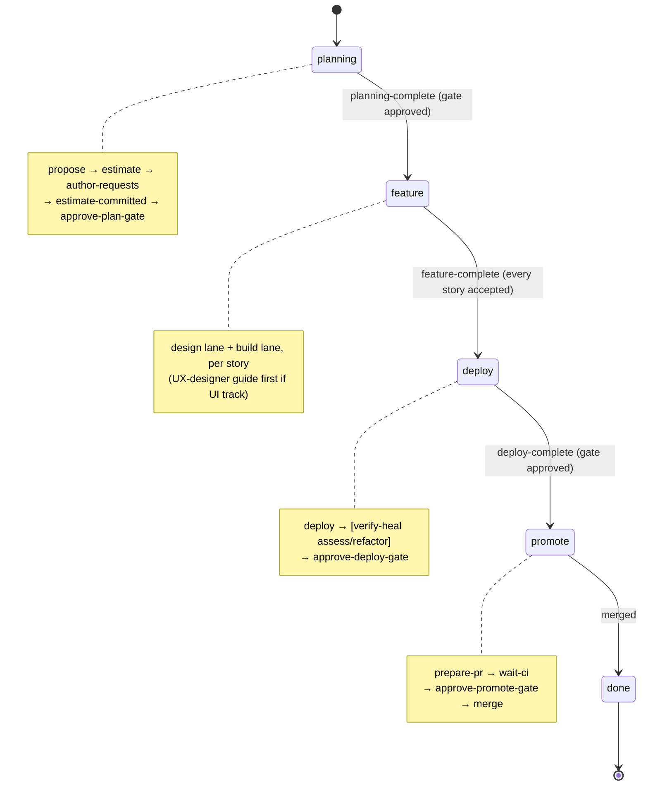
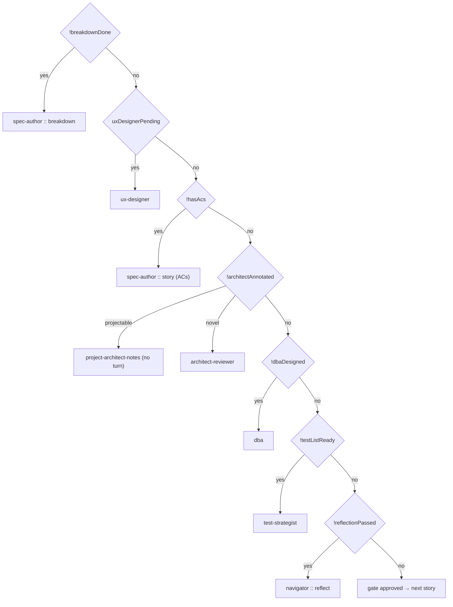
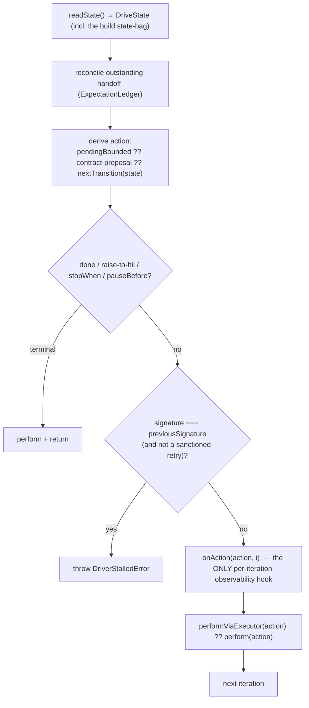
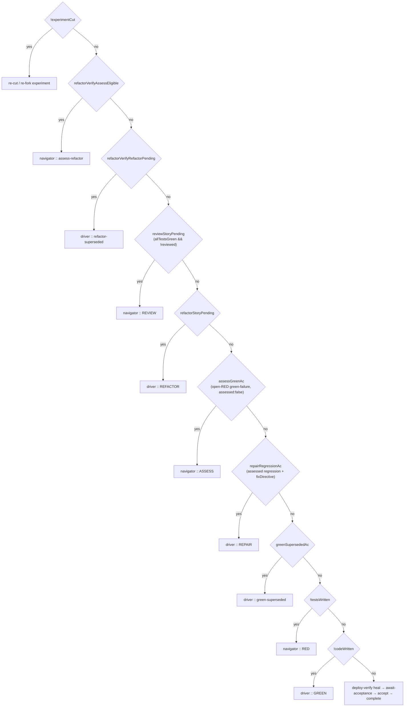

# Master Canonical Process

The contract-level specification of Consort: **how the framework works, and how you would rebuild it
from scratch.** It describes the orchestration's state machine, its step contract, its dispatch +
recording seams, and its per-step payloads — the invariants a reimplementation must honor, not an
implementation walkthrough. Read top to bottom: the phase machine (§0), the drive loop + dispatch
(§0.4–0.5), the step contract + process events (§1), the per-step template + chains (§2–§4, §7), the
recording + capture surfaces (§5–§6), and the build-from-scratch contract summary (§8).

> **Resuming / picking up unfinished work?** §0–§8 are the current, live contract (what IS). **§9 Open
> work** lists what is NOT yet resolved — the gated live capture, the build-code collapse, the
> capture-flow tail, standing hygiene, and pre-existing WIP on a sibling branch. Start there.

**The code is the ground truth; this doc states the contract it must satisfy.** Every node, edge, and
payload is derived from the routing/state code (`consort/orchestrator/drive/orchestrator-drive.ts`,
`orchestrator/state/*`, `pipeline/cycle-record.ts`), the step contract
(`orchestrator/steps/step-contract.ts`), and the shipped manifests
(`orchestrator/steps/manifests/*.json`). If the code is observed to do something this model does not
name, the model is wrong and must be updated — with `file:line` citations kept current.

Two dimensions:
- **Graphs** — the observable ROUTES. The orchestrator is a deterministic state machine
  (`nextTransition(state) → action` is a pure function of recorded state), so its routes ARE a
  graph: nodes = steps/phases, edges = the routing predicates that fire. Rendered as mermaid.
- **Tables** — the per-node PAYLOAD (inputs → emits → produces, channels, validators, agent
  config), which is tabular, not topological. See the per-step template + chain sections.

**The load-bearing invariants** (the things a rebuild MUST get right; each detailed below):
1. Routing is a PURE function of recorded state (`nextTransition`); no I/O, no model in the router (§0).
2. Every played turn dispatches through the ONE executor Template Method; the legacy path is guarded
   dead (§0.5).
3. A step is dumb + contained; the orchestrator owns `.consort`, resolves inputs, validates outputs,
   and is the sole routing authority (§1).
4. A route to a turn is BOUND to that turn's input contract via declared process events + the
   pre-dispatch route-satisfiable check , a mis-route fails loud naming the route, never silently (§1.1).
5. The HIL is one interface with two implementations (human / Human Proxy); the automated path is
   IDENTICAL to interactive, only the HIL impl differs (§6.6).
6. Every turn + every HIL exchange is recorded deterministically, so a run is fully replayable (§5–§6).

---

## 0. The beginning — the top-level phase machine

`nextTransition(state)` (`orchestrator-drive.ts:195`) is THE entry point. Given the recorded
`DriveState`, it returns the single next `WorkflowAction` — no I/O, no model. Escalation
(`escalationPreempt`) pre-empts everything first. Then it dispatches by `state.phase`:



Any phase can be pre-empted to `raise-to-hil` by `escalationPreempt(state)` — escalation never
false-greens past a problem or spins on await-acceptance.

### 0.1 Planning lane (`state.phase === "planning"`)


`--no-sizing` (`skipSizing`) drops both estimate steps. The plan gate is the HITL checkpoint that
locks the backlog before any feature is driven.

### 0.2 Feature lane (`state.phase === "feature"`) — design + build, per story

The feature phase streams design and build. It always advances the FIRST not-yet-done story
(structural: exactly one story in design at a time), so the spec-author is invoked per story.


### 0.3 Design lane (`nextDesignAction`, `orchestrator-drive.ts:53`)

Per the first not-yet-gate-approved story, in breakdown order:



---

## 0.4 The drive loop + observability (`runDriver`, `orchestrator-run.ts:189`)

`nextTransition` is the pure brain; `runDriver` is the loop that turns it. Per iteration
(`orchestrator-run.ts:227-340`):



**The observability seam — and the gap that matters for a route-debugging re-record:**

`onAction(action, i)` (`orchestrator-run.ts:57`, `319`) is the sole per-iteration hook. It receives
**the action that was chosen and the iteration index — NOT the `DriveState` / build state-bag that
chose it.** The loop reads `state` at line 234, derives `action` from it, then logs only `action`.

Consequence: when a green routes to `review` instead of `assess`, the recorded log shows
*"review was chosen at iteration N"* but never *"`{reviewStoryPending:true, assessGreenAc:false,
allTestsGreen:true}` is why review won."* The **decision inputs are not captured** — which is
exactly why route bugs cannot be diagnosed from the recorded corpus and had to be reverse-engineered
from stale artifacts. `onAction` already receives the action; the state bag it was derived from is
available in the same scope (`state`) but is not passed. This is the seam where routing
instrumentation belongs (see §6, instrumentation plan — TODO after the logging inventory).

The other effects the loop drives:
- `readState()` — builds `DriveState` from disk (the probes in §4 read the same disk state).
- `perform(action)` / `performViaExecutor(action, state, routerDeps)` — runs the turn. The executor
  path already ran `validateAndBound` (phase 7) and hands back a `BoundedRoute` consumed next
  iteration (`pendingBounded`); the non-executor path performs then asks the contract for a proposal.
- `onHandback(handoff, detail)` — fired when a responder's contract was unmet (one informed retry).

---

## 0.5 Dispatch paths — executor (canonical) vs legacy (`executor-dispatch.ts:89`)

An agent turn (`invoke-role`) is dispatched one of two ways, decided by `executorDispatched(action)`.
This split is documented for transparency because "which path a turn takes" governs what gets
recorded + which behaviors apply.

**Executor path (canonical, the intended sole path):** `performViaExecutor` → the StepExecutor
Template Method → `ClaudeStepAgent` via `liveDispatchSeam`. Records the full replay-set (§6.5),
captures the transcript (via the record wrapper), runs the manifest's pre/post-turn hooks + output
validation + `validateAndBound`. `executorDispatched` returns **true** for:
- spec-author `breakdown` / `propose`; architect-reviewer `estimate`
- per-story design: spec-author (ACs) / architect-reviewer / test-strategist / dba (all story-scoped); ux-designer (feature-scoped)
- navigator `reflect` / `assess` / `assess-deploy` / `assess-refactor` / `review` (story-scoped)
- driver + navigator RED/GREEN and the driver self-heal buildModes (story-scoped)

**Legacy path (`commandsForAction`, being deprecated):** for actions `executorDispatched` returns
**false**, `performViaExecutor` returns `undefined` and the turn falls to `commandsForAction`
(`orchestrator-effects.ts`). Today that is:
- **`product-owner` `author-requests`** and **`architect-reviewer` `estimate-committed`** (`executor-dispatch.ts:98`) — the two agent modes NOT yet migrated. They run every sprint.
- Any un-allowlisted role/mode, or an env override `LAKEBASE_SFTDD_USE_MANIFEST_STEPS=0/false/off/no` which forces ALL actions to legacy.
- **Non-agent actions** (`planning-complete`, `feature-complete`, `deploy-complete`, gates, dispatch,
  cut-experiment, `set-phase`) are `kind !== "invoke-role"` → they are NOT agent turns and correctly
  flow through the deterministic `commandsForAction` path. `set-phase` (the phase-transition writer)
  lives here BY DESIGN — it is a drive-loop concern, never an agent turn, so it is NOT an executor
  gap.

**Divergence found + status (the reason this section exists):** the legacy contained-spawn path
captured the agent TRANSCRIPT; the executor path dropped it (a double-consume race on
`takeLastAgentTranscript`). FIXED — the intermediate consumer now PEEKS (`peekLastAgentTranscript`),
leaving the record wrapper as the sole taker. A per-turn hard-fail audit (`assertTurnComplete`, §6.5)
now aborts a live capture the moment any agent turn is missing its expected recorded files, so a
silent drop like this cannot recur.

**Deprecation — DONE (runtime hard-stop live).** `author-requests` + `estimate-committed` are
NOT agent turns (author-requests is human-input via the proxy; estimate-committed's work is a
deterministic sync-backlog), so instead of migrating them to the agent executor they are named in a
sanctioned **`deterministicAgentless`** allowlist (`executor-dispatch.ts`). The runtime guard
**`assertNotStrandedAgentTurn`** now runs at the TOP of `perform` (orchestrator-effects.ts): any
`invoke-role` action reaching the legacy path that is neither `executorDispatched` NOR
`deterministicAgentless` **throws loud** (a real agent turn escaped the executor , silent-corruption
class). Non-invoke-role drive actions (gates/dispatch/phase transitions/set-phase) are exempt.
Proven by `tests/bdd/legacy-path-guard.test.ts`. So a live run can no longer silently run an agent
turn on legacy. (Full retirement of the `commandsForAction` agent arm is standing hygiene, §9.4; the
guard makes any residual agent arm fail loud in the meantime.)

---

## 1. The canonical model — `StepContract`

`consort/orchestrator/steps/step-contract.ts` defines the ONE interface every step implements.
A step is dumb + contained: it declares logical descriptors; the **orchestrator** owns `.consort`,
resolves them to real paths, provides contents, validates outputs, and decides the route.

A step has **eight faces**:

| Face | Signature | What it declares |
|---|---|---|
| `inputs` | `(action) => StepInputSpec[]` | Logical inputs that must exist before it runs (id + description; orchestrator resolves the path + hands back contents under `id`). |
| `preconditions` | `(action) => StepPrecondition[]` | Prepared context blocks (context-pack, green-failure-advisory) the orchestrator PROJECTS from `.consort` and appends/prepends to the prompt. Never authored, cannot drift. |
| `outputs` | `(action) => StepOutputSpec[]` | Logical artifacts it produces: id, description, channel-relative `filename`, `channel`, `optional?`, and an in-code `validate` (hard reject on fail, no agent round-trip). |
| `postTurn` | `(action) => PostTurnHook[]` | Deterministic pipeline hooks the orchestrator runs AROUND the turn (not the agent): `{bin, args, when: before\|after}`. |
| `agentOptions` | `(action) => AgentOptions` | Per-step agent-spawn levers: `{model?, effort?, session, resumeKeyFrom?}`. The optimize sweep patches these per candidate. |
| `raises` | `(action) => TurnEventSpec[]` | The process EVENTS this step may raise on completion (see §1.1). Empty = an affirmative "raises nothing". |
| `requiresEvents` | `(action) => TurnEventKind[]` | The process EVENTS a route to this step depends on , the markers a prior turn must have raised before it may be dispatched (see §1.1). Empty = "requires no event". |
| `route` | `(completed, ctx) => RouteProposal` | The routing intent it EMITS on completion: `{outcome, proposedNext, reason?}`. |

**`StepOutcome`** (what a step REPORTS): `produced` \| `blocked` \| `revise` \| `escalate`.

The single real implementation is `Step` (`steps/step.ts`), driven ENTIRELY by a manifest + the
validator registry + an injected agent — every face reads from the manifest. `MockStepContract` is the
test double. There is no bespoke per-role class.

**Output channels** (where a produced file lands):
- `product` — the app deliverable (`app/`, `tests/`, migrations). ALWAYS uncontained (the real
  code tree); accumulates across build turns and ships.
- `artifact` — `.consort` design docs (feature-spec, architecture, acs, proposals). MAY be
  contained under `artifactDir`.
- `meta` — orchestrator bookkeeping (agent-log, reflect verdict, assess marker). Contained under
  `metaDir`.
- (absent) — the primary workspace root; byte-identical to a pre-channel single-root turn.

**The orchestrator is the authority over routing.** A step only PROPOSES `proposedNext`;
`validateAndBound` (step-contract.ts) validates it against the pure allowed transition and bounds
re-routes/retries/escalations:
- `produced` → honored iff it equals the pure allowed transition; else FALL BACK to allowed.
- `revise` → honored iff the revise budget has room; else convert to `raise-to-hil`.
- `blocked` → sanctioned retry of the same step until the retry ledger is exhausted (throws).
- `escalate` → straight to `raise-to-hil`.

**Exactness guard.** `assertExactStepContract(impl, label)` outright FAILS any implementation that
declares a member the canonical model does not name (TypeScript `implements` is a structural lower
bound and cannot reject an extra method). The allowlist `STEP_CONTRACT_MEMBERS` is pinned to the
interface at compile time via `satisfies Record<keyof StepContract, true>`, so it can never drift.
A StepContract impl therefore keeps private helpers as MODULE-LEVEL functions, not methods.

### 1.1 Process events + the route→contract binding

The build lane is producers→consumers: one turn writes a marker, a later turn's ROUTE depends on it.
Those markers are declared as first-class **process events** (`steps/turn-events.ts`), so the
producer→event→router→consumer chain is one checkable contract instead of four disconnected files.

`TurnEventKind` (the closed set, each a JSON marker in the cycle dir): `green-failure`,
`superseded-tests`, `regression-assessment`, `review-verdict`. Each has a `TurnEventSpec` in the
`TURN_EVENTS` registry (`satisfies Record<TurnEventKind, TurnEventSpec>`, pinned) declaring its
`filename` and an ACTION-AWARE `scopeFor(action)`: `feature` | `story` | `ac` | `cycle`. Most events are
fixed-scope (`green-failure`/`superseded-tests`/`regression-assessment` = `cycle`); `review-verdict` is
dual-scoped (`cycle` when the action carries an `ac`, `story` otherwise).

A step declares what it `raises` and what it `requiresEvents` (the two faces above). The MANIFEST is the
single source: `driver-green` raises `green-failure`; `navigator-assess` requires `green-failure` +
raises `superseded-tests`/`regression-assessment`; `navigator-review` raises `review-verdict`;
`driver-repair` requires `regression-assessment`; `driver-refactor` requires `review-verdict`.

**The pre-dispatch route-satisfiable check** (`steps/assert-route-satisfiable.ts`) is the seam that
BINDS a route to the input contract of the turn it targets. Before dispatch, it resolves the routed
action's required events and presence-checks each artifact at its scope; a missing one throws
`RouteContractError` naming the ROUTE ("route selected turn assess (AC1) but its required event
green-failure was not produced; expected …"), NOT a bare late "missing input". It is wired as an
optional `DriveEffects` hook the loop calls before dispatch, so an unwired driver is byte-identical; the
executor's own input presence-check (`MissingInputError`, `step-executor.ts`) stays as defense-in-depth.

**Input scope.** A manifest input `source` prefix selects where the orchestrator resolves it:
`feature:<rel>` under the feature dir, `story:<rel>` under `storyResolved`, `cycle:<rel>` / `ac:<rel>`
under `cycleDir(f, s, ac)`. The cycle scope is what lets a turn read a marker the router saw at AC scope
(e.g. `navigator-assess` reads `cycle:green-failure.json`).

---

## 2. The per-step template

Every step below is documented in this standard shape:

```
### <step-id>
- Role / agent:      <role> via <agent kind>
- Binds to (match):  <the WorkflowAction shape that dispatches this step>
- Reached when:      <the routing predicate upstream that emits this action> (file:line)
- INPUTS:            <id> ← <source>  — <what it is>
- PRECONDITIONS:     <id> (<kind>, <position>) | none
- EMITS / PRODUCES:  <id> → <channel>/<filename>  [validator]  <required|optional>
- REPORTS:           <StepOutcome>
- ROUTES:            <manifest routing.produced.next → resolved next>
- POST-TURN:         <bin args when | none>
- AGENT CONFIG:      model / effort / session / resumeKeyFrom
```

---

## 3. The spec-author chain

The Spec Author has **three** orchestration steps, distinguished by the `match` on the action.

### spec-author-breakdown
- **Role / agent:** spec-author via `claude`
- **Binds to:** `{invoke-role, role:spec-author, mode:"breakdown"}`
- **Reached when:** `!state.breakdownDone` — the first design-lane action (`orchestrator-drive.ts:54`)
- **INPUTS:**
  - `product-overview` ← `feature:product-overview.md`
  - `nfrs` ← `feature:nfrs.md`
  - `feature-request` ← `feature:feature-request.md`
- **PRECONDITIONS:** none
- **EMITS / PRODUCES:**
  - `feature-spec` → **artifact**/`feature-spec.json` [featureSpecNonEmptyStories] — required (the feature breakdown index + a story stub per story)
  - `agent-log` → **meta**/`agent-log.jsonl` [agentLogHasRoleEvent] — required
- **REPORTS:** produced
- **ROUTES:** `state-derived` → re-derive next design action (→ ux-designer if UI track, else first story's ACs)
- **POST-TURN:** `PIPELINE_BIN reset-breakdown --tdd` (before); `PIPELINE_BIN sync-breakdown --tdd` (after)
- **AGENT CONFIG:** model=haiku, effort=low, session=**fresh**, resumeKeyFrom=role

### spec-author-propose (sprint-planning lane)
- **Role / agent:** spec-author via `claude`
- **Binds to:** `{invoke-role, role:spec-author, mode:"propose"}`
- **Reached when:** planning lane, `!planning.proposed` (`orchestrator-drive.ts:203`)
- **INPUTS:**
  - `product-overview` ← `feature:product-overview.md`
  - `nfrs` ← `feature:nfrs.md`
- **PRECONDITIONS:** none
- **EMITS / PRODUCES:**
  - `feature-proposals` → **artifact**/`planning/feature-proposals.md` [nonEmptyFile] — required.
    **Sprint-scoped → NO reconcile** (writes no feature artifact).
- **REPORTS:** produced
- **ROUTES:** `state-derived` (→ architect-estimator for sizing, or author-requests if `--no-sizing`)
- **POST-TURN:** none
- **AGENT CONFIG:** model=opus, effort=low, session=resume, resumeKeyFrom=role

### spec-author-story (per-story ACs)
- **Role / agent:** spec-author via `claude`
- **Binds to:** `{invoke-role, role:spec-author, mode:null, buildMode:null}` (bare per-story)
- **Reached when:** a story in breakdown order has `!design.hasAcs` (`orchestrator-drive.ts:81`)
- **INPUTS:**
  - `story-stub` ← `story:story.json`
  - `product-overview` ← `feature:product-overview.md`
- **PRECONDITIONS:** none
- **EMITS / PRODUCES:**
  - `acs` → **artifact**/`acs` (DIRECTORY, one `acs/<AC>.json` per AC) [acsDirConformant] — required
  - `agent-log` → **meta**/`agent-log.jsonl` [agentLogHasRoleEvent] — required
- **REPORTS:** produced
- **ROUTES:** `state-derived` (→ the architect step for the same story: `project-architect-notes` or `architect-reviewer`)
- **POST-TURN:** none
- **AGENT CONFIG:** model=opus, effort=low, session=resume, resumeKeyFrom=role

---

## 4. Build lane — `nextBuildAction` (`orchestrator-drive.ts:138`)

The build lane routes one story through RED → GREEN → REVIEW → REFACTOR, with self-heal detours.
The checks fire in a FIXED PRECEDENCE (first match wins); the order is load-bearing (self-heal +
review/refactor sit ABOVE the plain RED/GREEN so a just-greened AC is reviewed before the lane
advances). Edges are the state-bag predicates, top to bottom:



(`loop === "story"` uses `reviewStoryPending`/`refactorStoryPending`; `loop === "ac"` uses the
per-AC `reviewAc`/`refactorAc` at the same precedence slot.)

### 4.1 Routing mechanism: review vs assess after a driver GREEN

This is the decision the driver-optimize sweep tripped over, documented from source so it is not
re-derived by guesswork.

**In the graph above, `reviewStoryPending` is checked BEFORE `assessGreenAc`.** When both could be
true, **review wins**.

**`reviewStoryPending`** = `reviewPending()` (`cycle-record.ts:965`):
```
allTestsGreen && !reviewed
```

**`assessGreenAc`** = `assessGreenFailureAc()` (`orchestrator-probe.ts:343`):
```
the open-RED cycle's AC, when its GREEN verify FAILED and left a green-failure marker with assessed:false
```

**`storyAllTestsGreen`** (`cycle-record.ts:944`): `allGreen` over the story's test progress.

### The rule (canonical)

- **Assess is FAILURE-driven.** It fires ONLY when a green verify FAILS and writes a
  `green-failure.json` marker on an open-RED cycle. It is not driven by any code diff or
  contract change.
- **Review is ALL-GREEN-driven.** A green that passes the full suite makes the story all-green
  with no pending review → review. This is correct: a clean green SHOULD be reviewed.

### Consequence (canonical)

The assess route is reachable ONLY by a green that genuinely FAILS the full suite (e.g. a correct
change that breaks a prior test the story supersedes → `green-failure.json` → assess). A green that
passes its own suite is all-green with no failure marker → `reviewStoryPending` → review. The two are
mutually exclusive by construction: a failure marker routes to assess and pre-empts review.

---

## 5. Logging inventory — the turn recorder (`turn-recorder.ts`)

`recordTurn` (`logging/turn-recorder.ts:253`) fires AFTER each turn's effect lands (wired via
`withTurnRecording`, gated on `LAKEBASE_CONSORT_RECORD_DIR`). Per turn it writes under
`turns/<NNNN>-<label>/`:

| Artifact | Content | Source |
|---|---|---|
| `turn.json` | `{ordinal, step, label, kind, role, mode, story, ac, action, produced[], deleted[], transcript?}` | the performed `action` + the file delta |
| `files/<rel>` | the `.consort` + code **delta** — every watched file whose sha changed this turn | `scan()` vs `.recorder-state.json` |
| `transcript.md` | prompt + final reasoning + ordered tool list (invoke-role turns only) | `RecordedTranscript` |
| `recorded-artifacts/<rel>` | cumulative `.consort` mirror (replay reads this) | mirrored from the delta |
| `turns/index.json` | ordered list of every turn | appended each turn |
| `.recorder-state.json` | relpath→sha map for the next turn's delta | rewritten each turn |

The record dir also carries three run-level streams (siblings to `turns/`):

| Stream | Content | Writer |
|---|---|---|
| `routing-decisions.jsonl` | per iteration: `{iteration, source, action, stateBag, at}` — the build state-bag (`reviewStoryPending`, `assessGreenAc`, `allTestsGreen`, …) that `nextTransition` READ to choose the action , the routing "why" | `recordRoutingDecision`, via the `onRoutingDecision` DriveEffects hook |
| `correspondence.jsonl` | per HIL exchange: the orchestrator's REQUEST + the HIL's ANSWER/SUBMISSION + outcome + presentation (§6.6) | `recordCorrespondence`, via `onCorrespondence` |
| `run-config.json` | the resolved model/effort/option matrix for the run | `writeRunConfig` |

**The three logs and how they key together.** A run's timeline lives in three sibling logs under the
record dir, each carrying a DIFFERENT subset of the join keys:
- `turns/index.json` (+ each `turns/<NNNN>/turn.json`) — keyed by **`ordinal`** (0-based, monotonic =
  index length at record time) + `action`; `iteration`/`seq` are **`null`** (the recorder assigns its
  own `ordinal`, it is not handed the drive `iteration`).
- `routing-decisions.jsonl` — keyed by **`iteration`** + `action`; no `ordinal`.
- `correspondence.jsonl` — keyed by **`seq`** + **`iteration`** (+ `phase`, `request.kind`); no `ordinal`.

So `correspondence` and `turns` share NO literal key; the bridge is the drive-loop counter
(`correspondence.iteration` ↔ `turn.ordinal`, scoped by `phase`; 1:1 in planning, kickoff = `iteration
-1` before turn 0) — a POSITIONAL join, not a hard foreign key. `routing-decisions.jsonl` is the
reconstruction bridge (it and `turns/` are both drive-loop-ordered and both carry `action`). The
go-forward fix (stamp an explicit shared key) and the retroactive backfill (zip routing↔turns on
`action` to recover `iteration → ordinal`) are in **§9.6**.

**Marker lifecycle is observable through the delta:** a written `green-failure.json` lands in
`produced[]` + `files/`, so the produce→consume of a process event is visible without special casing.

**Per-turn hard-fail audit.** In a LIVE capture, `assertTurnComplete` (`turn-recorder.ts`) aborts the
moment any agent turn is missing an expected file (transcript, replay-set, delta), so a dropped
artifact fails at that turn instead of yielding a silently-incomplete corpus. `expectedTurnFiles`
is the template of what each turn must carry.

**Post-run corpus audit.** `auditCorpus(recordDir)` (`consort/logging/audit-corpus.ts`) reports
per-turn completeness + routing-log coverage; `requireAssess:true` additionally asserts the
failing-green→assess path was captured.

---

## 6. The recording surfaces

A recorded run is fully replayable: the recorder captures every turn's output delta + transcript, the
routing decision that chose each turn, and the HIL correspondence. Recording is on when
`LAKEBASE_CONSORT_RECORD_DIR` is set; `recorded-build/` (the per-turn code corpus) is auto-derived.

The assess path is only captured when a green genuinely FAILS (§4.1): the scenario must contain a prior
test a correct green breaks (the supersession case) so the full-suite verify fails →
`green-failure.json` → assess. The stockflow F6/S3 split-tracking story is the natural carrier (a
correct `inventory_code`-split green breaks the old combined-column tests). A scenario whose greens all
pass captures only the review path.

---

## 6.4 The capture launcher — how a live re-record is driven (from the shell code)

The live re-record ("capture": design AND build run LIVE, every turn recorded) is driven by
`examples/replay/run-capture.sh` → `examples/replay/_replay-smoke.sh` (`replay_smoke`). The invocation
contract below is what a launcher must satisfy for a live capture to succeed.

**Invocation contract (`replay_smoke` arg parser, `_replay-smoke.sh:58`):**
- Accepted flags: `--tiers` (**required**, e.g. `2` = prod+staging), `--kit-ref`, `--project-name`,
  `--project-dir`, `--feature <F>`, `--sprint <name>`, `--plan-only`, `--corpus <PATH>`.
  There is **no `--scenario` flag** (that belongs to the sibling `replay-scenario.sh`).
- `--corpus` is a **path**, used as `<CORPUS>/features/<FEATURE>/…`; it must point at a corpus's
  `recorded-artifacts` dir and `--feature` must name a feature present there (which must carry a
  `feature-request.md`).

**Environment (hard preconditions, `_replay-smoke.sh:125`):** `DATABRICKS_HOST` and `GITHUB_OWNER`
must be **exported** — the engine does NOT source the test config itself (unlike
`replay-stockflow-rerecord.sh`). A launcher must source `.env.local.test.config`, resolve
`DATABRICKS_HOST` from the profile, and export `GITHUB_OWNER` (from `LAKEBASE_TEST_GITHUB_OWNER`)
before calling. This is why the checked-in launcher `examples/replay/captures/launch-stockflow-instrumented.sh`
exists: it does that env-prep, sets the recording + resume env, and invokes `run-capture.sh` with
the correct args.

**Recording + unattended resume:**
- `LAKEBASE_CONSORT_RECORD_DIR=<persistent dir NOT under the project>` turns recording on;
  `_replay-smoke.sh` auto-derives `LAKEBASE_CONSORT_RECORD_BUILD_DIR=<RECORD_DIR>/recorded-build`.
  `routing-decisions.jsonl` + `correspondence.jsonl` (§5) are written at the same `recordDir`.
- `run-capture.sh` sets `PAUSE_BEFORE=navigator`; `LAKEBASE_SFTDD_AUTO_CONTINUE=1` auto-confirms
  that pause so the run does design→build in one process, unattended.
- The manifest-steps path is pinned ON (`LAKEBASE_SFTDD_USE_MANIFEST_STEPS=1`) so the executor is the
  sole agent path + the route-satisfiable seam fires; a stray `=0` cannot drop the capture to legacy.

**Scaffold-vs-reuse:** `FRESH=1` unless `$PROJECT_DIR/.git` exists, in which case `FRESH=0` → reuse
(skip scaffold). This is what lets a multi-sprint / multi-feature capture share ONE project (only the
first invocation scaffolds; see §6.6). A capture must start from a project dir with no pre-existing
`.git` (a half-initialized dir from a crashed prior launch has a `.git` but no `scripts/lk` shim, so
the reuse path then fails "could not resolve the runtime artifact dir") — use a fresh stamp or clean
the dir first.

**Intake-dir invariant:** `--corpus` sets ONLY `CORPUS_DIR` (recorded design/build artifacts). The
INTAKE dir (product-overview / nfrs / design-brief the project is seeded with) is resolved SEPARATELY
from `REPLAY_INTAKE_DIR` (default `corpora/bug-tracker`). A launcher MUST export `REPLAY_INTAKE_DIR` to
the scenario's own `intake/` dir; otherwise a foreign intake is staged and the spec-author breakdown
fails at turn 0 with `missing input "nfrs"` (after provisioning — it costs cloud).

**Feature-branch base invariant (SCM claim + tier topology):** intake + the feature-request must be
committed on the PARENT TIER and pushed to origin BEFORE the claim. `lk lakebase-scm-claim-feature-branch`
forks the feature from `resolveFeatureStartPoint(resolveParentBranch(tier))`, which prefers
`origin/<parentBranch>` (the git fork point must match the paired Lakebase branch's promoted state).
Parent branch by topology: tier-2 ⇒ `staging`, tier-3 ⇒ `dev`, tier-1 ⇒ the default branch. So for a
tier-2 scenario the harness checks out `staging`, commits intake + feature-request there, and pushes
`origin/staging` before claiming — else the feature forks WITHOUT intake and breakdown fails
`missing input "nfrs"` at turn 0. (scm-utils' tier/fork-point logic is authoritative; the launcher
commits to the branch it dictates, never the reverse.)

## 6.5 The per-agent-turn REPLAY SET (for optimization experiments)

Each agent turn records a self-contained **replay set** under `turns/<NNNN>-<label>/replay-set/`, so
an optimization experiment can replay THAT manifest step in isolation (sweep levers, re-run, judge)
without replaying the rest of the corpus. Written by `recordReplaySet` (`turn-recorder.ts`) from the
record wrapper's `recordingInvoke` **before** the agent mutates the tree:

| Part | Content | Source |
|---|---|---|
| `pre-project/` | the FULL project code tree BEFORE the turn (codeTreeFilter: app/tests/migrations; NEVER `.consort`/junk) | `walk(projectDir, codeTreeFilter)` |
| `inputs/<id>` | resolved input CONTENTS handed to the step, keyed by logical id | `invocation.inputs` |
| `prompt.txt` | the fully assembled prompt (preconditions already inlined) | `invocation.instructions.prompt` |
| `guidelines.json` | instruction guidelines | `invocation.instructions.guidelines` |
| `levers.json` | resolved levers (agentOptions + agent.config: model/effort/session/toolScope) | manifest, via `resolveLevers` |

Rationale for the split: agent turns are the SOLE mutators of the project code tree (deploy + postTurn
hooks touch only `.consort` + pid), so a `pre-project/` snapshot at each agent turn is the complete
code pre-state — a step replays without reconstructing the tree from turns 0..N-1. `.consort` is NOT
snapshotted here (it is delta-tracked every turn by `recordTurn` + the cumulative recorded-artifacts
mirror). The turn's OUTPUT (post-state) is the `recordTurn` delta (code + `.consort`) already. Together
the bundle is pre-state (`pre-project/` + inputs/prompt/levers) + post-state (delta) = a full replay
set. Only agent turns get one (the record wrapper only wraps agent invokes); gates/deploy do not.

**Post-run audit:** `auditCorpus(<RECORD_DIR>)` (§5) reports per-turn completeness + routing-log
coverage; `requireAssess:true` asserts the failing-green→assess path was captured.

## 6.6 The INTERACTIVE-MIMIC capture — two sprints from a real /sprint + correspondence

The capture MIMICS an interactive session, not a headless side-channel. Step 0 is a real
`/sprint <name> --gates proxy`; the orchestrator ASKS for intake (the `/plan` Step 0 / `/design`
Step 0.5 interviews) and the **Human Proxy** answers (supplies the recorded product-overview / nfrs /
design-brief + the feature-requests, approves every gate). All of it is recorded.

**Two sprints, one project (the launcher loops):** `launch-stockflow-instrumented.sh` drives
`stockflow-rerecord-s1` (ships F1-stock-visibility) then `stockflow-rerecord-s2` (ships
F6-split-tracking-code) on ONE shared `--project-dir`. The first `run-capture.sh` invocation scaffolds
(`FRESH=1`); the second reuses (`FRESH=0`, `.git` present) so s2 builds on s1's merged state , the real
sprint cadence. Each sprint runs its own planning + feature drive to done.

**The per-sprint planning gate (a bug this flow fixed):** `_replay-smoke.sh`'s planning lane was gated
on `FRESH==1` (once per PROJECT), which SKIPPED sprint 2's planning entirely (it would reach the claim
with no feature-request). It is now gated PER-SPRINT on `sprints/<sprint>/requested.json` (written by the
author-requests turn): planning runs when `--sprint` is set AND that sprint is not yet planned. Project
INTAKE stays `FRESH`-gated (product-overview/nfrs are project-level, refined across sprints, supplied
once); planning is per-sprint. Intake is supplied IN-RUN by the proxy (`consort-human-proxy supply` from
`REPLAY_INTAKE_DIR`), never a raw `cp`.

**Proxy full-lifecycle YES:** under `--gates proxy` the drive runs design→build→deploy→promote to done
per feature and the proxy approves EVERY gate (`drainGatesAsHumanProxy` iterates all `GATE_NAMES` incl.
deploy + promote). "Move to the next sprint" is the launcher advancing s1→s2 (two `/sprint`
invocations), NOT a gate.

**Correspondence (the recorded transcript):** `<RECORD_DIR>/correspondence.jsonl` records the
orchestrator↔HIL exchange , the orchestrator's REQUEST (kickoff / intake-interview / gate /
author-requests) paired with the proxy's ANSWER/SUBMISSION (intake.supplied artifact refs, gate
approve/reject + violations) + outcome, WITH the rich `presentation` (formatting/highlighting preserved
so a renderer reproduces the session). Types + writer: `CorrespondenceEntry` / `recordCorrespondence`
(`turn-recorder.ts`); emitted from the `withTurnRecording` wrapper's `onCorrespondence` (drive.cli.ts)
after each HIL touchpoint perform, plus a seq-0 kickoff entry at each `/sprint` start. A two-sprint
capture shows TWO kickoff entries.

**LIVE-RUN checks (not hermetically provable , verify on the gated run):** on sprint 2 the intake block
checks out `staging` on a project that already shipped+promoted F1 (confirm the checkout is clean +
staging is still the parent tier after s1's promote); the parent-tier push before s2's claim must carry
s1's merged state so F6 forks from the correct tip; `correspondence.jsonl` must show both sprints'
kickoff + gate/intake exchanges.

---

## 7. Per-step payloads — every chain (from its manifest)

Read from `consort/orchestrator/steps/manifests/*.json`. Format:
`INPUTS: id←source` · `PRE: id(kind,pos)` · `EMITS: id→channel/filename [validator]` · `CFG:
model/effort/session/resumeKeyFrom` · `POST: bin`. A step with no `EMITS` produces no static
artifact — it is verified by its `@build-cycle` record + the state-derived route (§0.4/§4), and its
marker (assess/review/reflect verdict) lands via the file delta the turn recorder captures. All
design/build chains route `produced → state-derived` (the orchestrator re-derives; §0).

### 7.1 Design lane

**architect-estimator** — `{role:architect-reviewer, mode:estimate}` (planning lane)
- INPUTS: `feature-proposals←feature:planning/feature-proposals.md`
- EMITS: `estimates→artifact/planning/estimates.json [nonEmptyFile]`
- CFG: opus / default / resume / role · POST: —

**architect-reviewer** — `{role:architect-reviewer, mode:null}` (per story)
- INPUTS: `acs←story:acs` · `nfrs←feature:nfrs.md`
- EMITS: `architecture→artifact/architecture.json [nonEmptyFile]` · `agent-log→meta/agent-log.jsonl [architectReviewerLoggedAuthoring]`
- CFG: opus / low / resume / role · POST: —

**dba** — `{role:dba}`
- INPUTS: `architecture←feature:features/{feature}/architecture.json`
- EMITS: `db-design→artifact/db-design.json [nonEmptyFile]` · `agent-log→meta/agent-log.jsonl [dbaLoggedAuthoring]`
- CFG: sonnet / low / resume / role · POST: —

**ux-designer** — `{role:ux-designer}`
- INPUTS: `design-guideline←feature:design/design-brief.md` · `product-overview←feature:product-overview.md`
- EMITS: `design-guide→artifact/design-guide.json [designGuideConformant]` · `agent-log→meta/agent-log.jsonl [uxDesignerLoggedAuthoring]`
- CFG: opus / low / **fresh** / role · POST: —

**test-strategist** — `{role:test-strategist}` (supervisor; fans out to per-analyst subagents)
- INPUTS: `acs←story:acs` · `architecture←feature:features/{feature}/architecture.json` · `db-design←feature:features/{feature}/db-design.json`
- PRE: `test-analyst-roster(test-analyst-roster, append)` — the injected analyst roster the supervisor fans out to
- EMITS: `test-list→artifact/test-list.json [nonEmptyFile]` · `agent-log→meta/agent-log.jsonl [testStrategistLoggedAuthoring]`
- CFG: sonnet / low / resume / role · POST: `TEST_LIST_BIN {tddDir} {feature} {story}`

### 7.2 Build lane — navigator

**navigator-red** — `{role:navigator, buildMode:null}` (authors the failing tests)
- INPUTS: `test-list←story:test-list-per-story.json` · `acs←story:acs`
- EMITS: `tests→product/tests [navigatorTestsAuthored]` (uncontained, ships) · `agent-log→meta/agent-log.jsonl [navigatorLoggedAuthoring]`
- CFG: opus / low / resume / **story** · POST: `@build-cycle`

**navigator-assess** — `{role:navigator, buildMode:assess}` (the failing-green discriminator, §4.1)
- INPUTS: `green-failure←story:green-failure.json` · `acs←story:acs`
- PRE: `advisory(green-failure-advisory, prepend)` — the failure advisory prepended to the ASSESS directive
- EMITS: — (writes a superseded-tests.json / regression-assessment.json marker via the delta, or NOTHING when it escalates a genuine regression)
- CFG: sonnet / default / resume / story · POST: `@build-cycle`

**navigator-review** — `{role:navigator, buildMode:review}` (all-green story review, §4.1)
- INPUTS: `code←story:code` · `acs←story:acs`
- EMITS: — (writes review-verdict.json via the delta; refactor:true/false)
- CFG: sonnet / low / resume / story · POST: `@build-cycle`

**navigator-reflect** — `{role:navigator, buildMode:reflect}` (pre-build design reflection)
- INPUTS: `design←story:design`
- EMITS: — (writes reflect-verdict.json via the delta)
- CFG: **haiku** / low / resume / story · POST: `@build-cycle`

**navigator-assess-deploy** — `{role:navigator, buildMode:assess-deploy}` (deploy-verify self-heal)
- INPUTS: `deploy-verify-assess←story:deploy-verify-assess.json`
- EMITS: `scope→meta/deploy-verify-scope.json [deployVerifyScopeConformant]` **(optional)** — absent when it escalates
- CFG: sonnet / default / resume / story · POST: `@build-cycle`

**navigator-assess-refactor** — `{role:navigator, buildMode:assess-refactor}` (refactor-verify self-heal)
- INPUTS: `refactor-verify-failure←story:refactor-verify-failure.json`
- EMITS: — · CFG: sonnet / default / resume / story · POST: `@build-cycle`

### 7.3 Build lane — driver

**driver-green** — `{role:driver, buildMode:null}` (makes the tests pass)
- INPUTS: `test-list←story:test-list-per-story.json`
- EMITS: `code→product/app [driverCodePresent]` (uncontained, ships) · `agent-log→meta/agent-log.jsonl [driverLoggedAuthoring]`
- CFG: sonnet / default / resume / story · POST: `@build-cycle`

**driver-repair** — `{role:driver, buildMode:repair}` (bounded fix of an assessed regression)
- INPUTS: `regression-assessment←story:regression-assessment.json`
- EMITS: — (re-greens the product code; correctness is the @build-cycle honest-GREEN, not a static artifact)
- CFG: sonnet / default / resume / story · POST: `@build-cycle`

**driver-refactor** — `{role:driver, buildMode:refactor}` (post-review cleanup)
- INPUTS: `code←story:code`
- PRE: `pack(context-pack, append)` — the design context-pack appended
- EMITS: — · CFG: **haiku** / default / resume / story · POST: `@build-cycle`

**driver-green-superseded** — `{role:driver, buildMode:green-superseded}` (permissive re-green after a supersession assess)
- INPUTS: `test-list←story:test-list.json` · EMITS: — · CFG: sonnet / default / resume / story · POST: `@build-cycle`

**driver-refactor-superseded** — `{role:driver, buildMode:refactor-superseded}` (refactor-verify self-heal re-refactor)
- INPUTS: `superseded-tests←story:superseded-tests.json` · EMITS: — · CFG: haiku / default / resume / story · POST: `@build-cycle`

**driver-refactor-deploy** — `{role:driver, buildMode:refactor-deploy}` (deploy-verify self-heal scope refactor)
- INPUTS: `deploy-verify-scope←story:deploy-verify-scope.json` · EMITS: — · CFG: haiku / default / resume / story · POST: `@build-cycle`

### 7.4 Observations from examining the manifests

- **Model tiering is per-turn, not per-role.** The navigator is opus for RED (authoring is the
  expensive reasoning) but sonnet for assess/review and haiku for reflect. The driver is sonnet for
  GREEN/repair but haiku for the refactor turns. Effort is mostly `default`/`low`.
- **Session is `resume` everywhere except two `fresh` turns** — spec-author-breakdown and
  ux-designer (both author once from scratch, no prior turn to warm from).
- **Build turns resume on `story` scope; design turns on `role` scope** — the resumeKeyFrom axis
  matches the lane's unit of continuity.
- **Every build turn's POST is `@build-cycle`** (the cycle recorder); design turns have no POST
  except breakdown (`reset/sync-breakdown`) and test-strategist (`TEST_LIST_BIN`).
- **Self-heal navigator/driver turns emit NO static artifact** — their marker lands via the file
  delta the turn recorder captures, and their route is state-derived off that marker. This is why
  §5's assess-path audit keys on the `green-failure.json` in the delta, not on a declared output.

---

## 8. Rebuilding Consort from scratch — the contract checklist

To reimplement Consort, satisfy these contracts in order. Each maps to a section above. This is the
minimal set of invariants; get these right and the framework's behavior follows.

### 8.1 The state machine (§0, §4)
- A single pure `nextTransition(DriveState) → WorkflowAction`: no I/O, no model. Escalation
  (`escalationPreempt`) pre-empts every phase. Phases: planning → feature (design+build per story) →
  deploy → promote → done.
- The build sub-router `nextBuildAction(story, build)` picks the next build turn from the story's
  state bag ALONE, in a fixed precedence (assess/repair/superseded before plain RED/GREEN; review vs
  refactor by loop granularity). Assess is FAILURE-driven (a `green-failure.json` on an open-RED
  cycle); review is ALL-GREEN-driven; the two are mutually exclusive.
- State is DERIVED from disk each iteration (the probe reads pipeline + cycle records + markers), never
  held in memory — so a run is resumable and a re-derive after any turn is authoritative.

### 8.2 The step contract (§1, §1.1)
- ONE `StepContract` with the eight faces; ONE real impl (`Step`) driven entirely by a manifest + the
  validator registry + an injected agent. Exactness guard + compile-pinned member allowlist.
- A step is dumb + contained: declares logical descriptors; the orchestrator owns `.consort`, resolves
  inputs (feature/story/cycle scope), validates outputs (in-code, hard reject), and is the SOLE routing
  authority (`validateAndBound` bounds a step's route proposal against the pure transition + budgets).
- Process events (`turn-events.ts`) are first-class: a step declares `raises`/`requiresEvents`; the
  pre-dispatch `assertRouteSatisfiable` binds a route to the target turn's input contract and fails
  loud NAMING THE ROUTE. The manifest is the single source of the event contract.

### 8.3 Dispatch + recording (§0.4, §0.5, §5, §6)
- Every played agent turn dispatches through ONE executor Template Method (`performViaExecutor` →
  `execute()` phases: resolve-inputs → provision → dispatch → capture → route). The legacy
  `commandsForAction` arm is guarded dead: `assertNotStrandedAgentTurn` throws if an invoke-role action
  reaches legacy without being executor-dispatched or a sanctioned deterministic-agentless action.
- Recording (gated on `LAKEBASE_CONSORT_RECORD_DIR`): per-turn delta + transcript + replay-set under
  `turns/<NNNN>/`; run-level `routing-decisions.jsonl` (the routing why) + `correspondence.jsonl` (the
  HIL exchange) + `run-config.json`; cumulative `recorded-artifacts/` + `recorded-build/`. A live
  capture hard-fails the moment a turn drops an expected artifact (`assertTurnComplete`).

### 8.4 The HIL + capture (§6.6)
- The HIL is ONE interface, two impls: a real human (interactive; the driver halts at gates) or the
  Human Proxy (headless; validates + approves/supplies from recorded material). The automated path is
  IDENTICAL to interactive — only the impl differs. The proxy never invents intent (refuses on
  missing/non-conformant material) and approves the full lifecycle (spec/plan/test_list/accept/deploy/
  promote).
- A capture MIMICS an interactive session: a real `/sprint --gates proxy` kicks it off; the orchestrator
  ASKS for intake (the `/plan` Step 0 / `/design` Step 0.5 interviews) and the proxy answers; two
  sprints run on one shared project (scaffold once, reuse; planning is PER-SPRINT); every exchange is
  recorded to `correspondence.jsonl` with its presentation preserved.

### 8.5 The kit-resolution contract (one way)
- EXACTLY ONE way to resolve the kit for a run (`resolve_kit_single_source`, `pin-local-kit.sh`):
  pin a local ref whose cache slot symlinks the working tree + write the ref into the project, so the
  orchestrator AND the env-less `claude -p` agents load IDENTICAL bits. NEVER `LAKEBASE_KIT_DIR` alone
  (orchestrator-only = split-brain). `--kit-ref` is the published escape hatch. A guard test forbids a
  second policy.

### 8.6 Operational invariants (a live run)
- **Dist is a build artifact:** manifests + TS bundle into `dist` at build; rebuild dist after any
  source/manifest edit or a run executes stale code. Commit source only.
- **Config has one home:** owner + profile + host live in `.env.local.test.config`
  (`DATABRICKS_CONFIG_PROFILE`), read via `provisioning/test-env.ts` (`resolveTestEnv`). Never inline
  the workspace host in source (a guard enforces this).
- **Reclaim orphans** after any stopped run: `databricks postgres delete-project projects/<name>
  --profile "$DATABRICKS_CONFIG_PROFILE"`, one per call; confirm zero left in the capture namespace.
- Never bypass git hooks (`--no-verify` is blocked). Track a live run by its log path +
  `postgres list-projects`, not an outer stamp (the launcher computes its own).

---

## 9. Open work — unresolved (resume here)

What is built + committed vs what remains. Everything above (§0–§8) is the current contract; the items
below are NOT yet done. Branch `capture/replay-set-instrumentation-and-fixes`; plans in `docs/plans/`.

### 9.1 The GATED live capture (the main remaining action)
The two-sprint `/sprint`-driven capture (§6.6) is BUILT but has NOT been run live. **READY-STATE (as of
this doc): dist rebuilt clean, auth OK, capture namespace has zero orphans, working tree committed** —
the only remaining step is the launch (gated — live Lakebase, needs explicit go). To run it:
1. **Dist** — must be freshly built (route-contract, kit-resolution, capture-flow, the manifest-steps
   flag pin all bundled) or the run executes stale code. NOTE: `npm run build` cleans dist first, so a
   build FAILURE leaves dist EMPTY. The build was unblocked by dropping the broken `optimize-role.cli`
   entry from `tsup.config.ts` (it imported an uncommitted `./driver-sweep.js`, #749); if the build
   fails again, dist is empty and the capture cannot run — fix the build before launching.
2. **Pre-flight** —
   - **Profile: the ONE source is `.env.local.test.config` (`DATABRICKS_CONFIG_PROFILE`).** The launcher
     resolves its profile + host from that file (§8.6); NEVER hand-pick a profile from a shell
     profile-list, the SessionStart context, or `.databrickscfg` — those list every profile on the
     machine, most of them wrong for this capture. Read the one value the launcher will use:
     `grep DATABRICKS_CONFIG_PROFILE .env.local.test.config`.
   - **Validate the LIVE token, not just the config.** `databricks auth describe` only reads the file and
     resolves a host — it passes even when the cached credential is dead. Mint a real token against the
     resolved profile: `databricks current-user me --profile "<that profile>"`. Only a returned
     `userName` proves auth; a `stored credentials from older CLI versions` / `error getting token`
     failure means re-login is needed (`databricks auth login --profile "<that profile>"`, interactive)
     BEFORE launching — a dead token half-provisions then orphans cloud resources.
   - Capture namespace has zero orphan `stockflow-instrumented` projects; the branch carries the fixes.
3. **Launch** `examples/replay/captures/launch-stockflow-instrumented.sh` (detached; tracked by log +
   `postgres list-projects`).
4. **Verify (live-only, can't be proven hermetically):** correspondence.jsonl has TWO kickoff entries
   (one per sprint) + both sprints' gate/intake exchanges; sprint-2's `staging` checkout is clean after
   s1's promote; the parent-tier push before s2's claim carries s1's merged state so F6 forks correctly;
   the run gets PAST the navigator-assess turn (the route-contract + green-failure `cycle:` scope fix).
   Prior blocker (now fixed): the run died at navigator-assess with `missing input "green-failure"` —
   the assess input was declared `story:` but the marker is written at `cycle:` scope (§1.1).

### 9.2 Build-code home collapse (unblocked, NOT built)
A build turn's code is recorded twice (`recorded-build/` story-keyed full trees + `turns/` flat
delta+pre-project). Collapse to `turns/` as the single home via OPTION 2 — reconstruct each turn's full
tree by replaying `turns/<n>/files/` deltas forward from turn 0 (existing corpora predate
`replay-set/pre-project/`, so per-turn snapshots are unavailable). Must PROVE byte-identical
reconstruction vs `recorded-build/code/` on a dual-home corpus before repointing `replayBuildTurn`;
then deprecate the `recorded-build` writer to fail loud if called. **Once a REPLAY confirms
`replayBuildTurn` reconstructs faithfully from `turns/` alone, the separate `recorded-build/` build-turn
subdirectory is no longer needed and can be RETIRED/REMOVED** (stop writing it + delete the existing
per-corpus `recorded-build/` trees) — the replay is the proof gate for removal. Plan:
`docs/plans/build-code-collapse.md`.

### 9.3 Capture-flow finish (CF Stage 6)
Hermetic guard on the launcher shape (two sprints declared; per-sprint planning gate) + a SKILL/doc
pass. The correspondence machinery + NFR/nfrs work + the launcher are done and committed; this is the
test-coverage + docs tail. Plan: `docs/plans/capture-flow.md`.

### 9.4 Standing hygiene (not blocking any capture)
- **Fully retire the `useManifestSteps` toggle + the legacy `commandsForAction`/`commandsFromManifest`
  arm.** Decided NOT required for capture (the flag is pinned ON; the `assertNotStrandedAgentTurn`
  guard makes any residual legacy agent arm fail loud). Retiring = delete the config field + env
  escape hatch + the legacy arm + rebaseline goldens.

### 9.5 Pre-existing WIP on the `massive-update` branch (NOT this work; carried over)
Parked uncommitted work was committed to a sibling `massive-update` branch (source-only; dist +
capture output excluded). It carries THREE known-broken items that fail the full suite / tsc and are
NOT from the contract work above: (a) `tests/optimization/optimize-role.cli.ts` imports a missing
`./driver-sweep.js` (12 tsc errors + 1 test failure; it is a CLI helper vitest does not run, so the
hermetic suite is otherwise green); (b) a navigator-reflect `agentOptions` model/effort resolver-parity
mismatch; (c) the `#595` workspace-host guard flags `OPTIMIZE-RUN-LOG.md`. These belong to whoever owns
the optimize-sweep + run-log work; they must be resolved before `massive-update` merges.

### 9.6 correspondence ⇄ turns join key (positional today; add an explicit key + a backfill)
A consumer that wants to align the human-proxy exchange with the turn it belongs to can do so today,
but the join is POSITIONAL, not a hard foreign key. Three sibling logs under the record dir carry
different subsets of the keys (verified live 2026-08-08):
- `correspondence.jsonl` — `seq` + `iteration` (+ `phase`, `request.kind`). **No `ordinal`/`dir`.**
- `routing-decisions.jsonl` — `iteration` + `action` (+ state bag). **No `ordinal`.**
- `turns/index.json` (+ each `turn.json`) — `ordinal` + `action` + `label`/`role`/`mode`/`story`/`ac`.
  **`iteration`/`seq` are `null` on turn records** (the recorder assigns its own monotonic `ordinal` =
  index length at record time; it never receives the drive `iteration`).
The reliable correlation: `correspondence.iteration` ↔ `turn.ordinal`, scoped by `phase` — the same
drive-loop counter, verified 1:1 in planning (iteration 2 ↔ ordinal 2 author-requests; iteration 4 ↔
ordinal 4 gate-plan; kickoff is `iteration: -1`, before turn 0). RISK: not guaranteed 1:1 across every
phase — a build cycle can dispatch several turns under one iteration, and kickoff has no turn — so a
naive `iteration==ordinal` join silently misaligns outside planning.

**Go-forward fix (one-field add; do NOT change mid-run — it forks the schema between an already-written
sprint 1 and sprint 2):** stamp the turn's `ordinal` (or `dir`) onto the correspondence entry in
`recordCorrespondence`, and/or the drive `iteration` onto `turn.json` in `recordTurn`
(`consort/logging/turn-recorder.ts`). Then the join is an explicit shared key, phase-independent.

**Retroactive backfill (for corpora already captured without the key):** the key is RECONSTRUCTIBLE —
no data was lost. `routing-decisions.jsonl` is the bridge: it and `turns/index.json` are BOTH appended
in drive-loop order and BOTH carry `action`, so a monotonic zip (i-th routing decision ↔ i-th turn of a
dispatching kind) yields an authoritative `iteration → ordinal` map without guessing. Algorithm:
(1) read routing-decisions in order → the `iteration` sequence of dispatched actions; (2) read
turns/index.json in order → the `ordinal` sequence, filtered to dispatching kinds (`invoke-role` +
gate turns, matched on `action`); (3) zip to build `iteration → {ordinal, dir}` (assert `action`
agrees at each step — a mismatch means the two streams diverged and the backfill must FAIL loud, not
guess); (4) rewrite each `turns/<dir>/turn.json` with the recovered `iteration`, and each
`correspondence.jsonl` entry with the matched `ordinal`/`dir` (kickoff `iteration:-1` → the pre-turn-0
sentinel, no ordinal). This is the SAME "reconstruct from the ordered deltas" technique as §9.2's
forward-delta collapse. Build it as a `bin/consort/backfill-correspondence-key.cli.ts` idempotent
migration (re-runnable; a second pass is a no-op once keys are present) + a hermetic test that a
backfilled corpus round-trips to the same join a go-forward capture would produce. Until it runs, the
positional `iteration↔ordinal` join above is the documented workaround.
