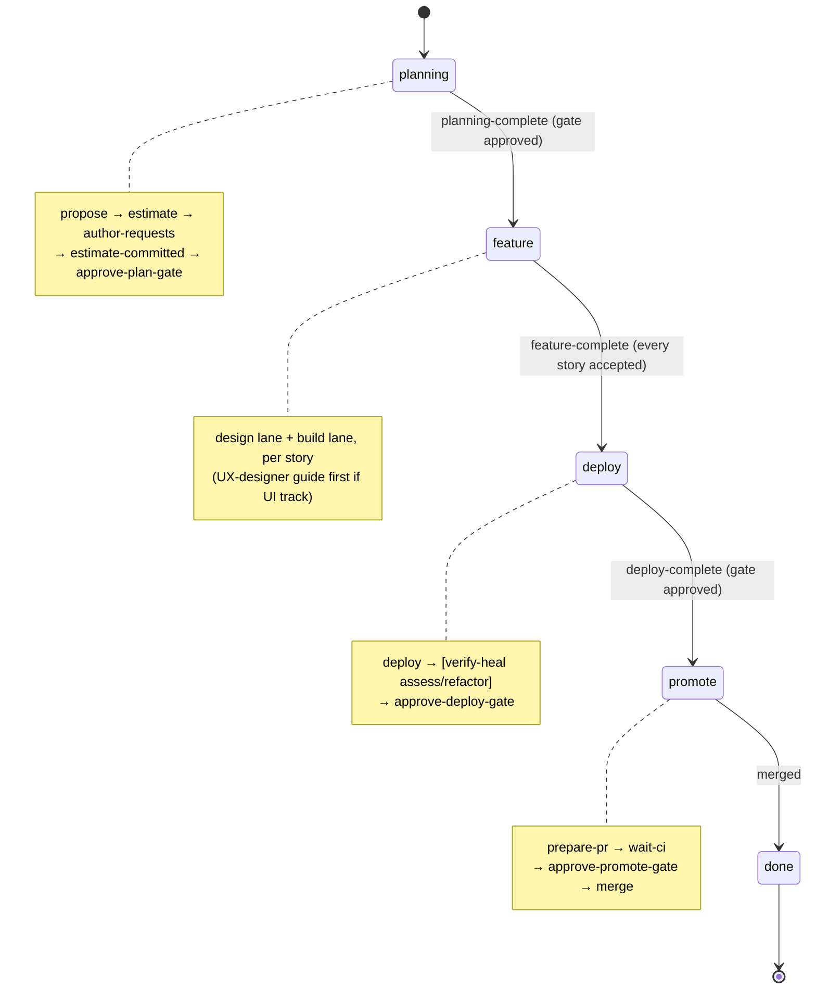
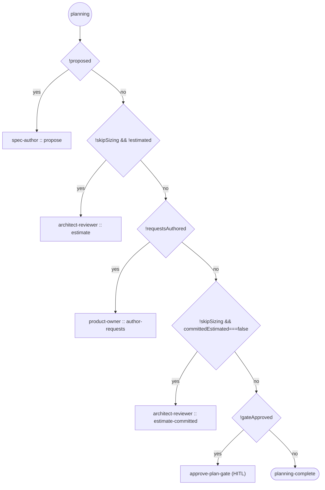
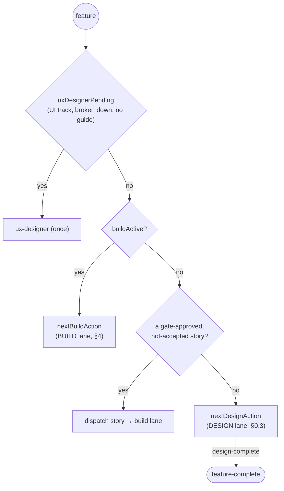
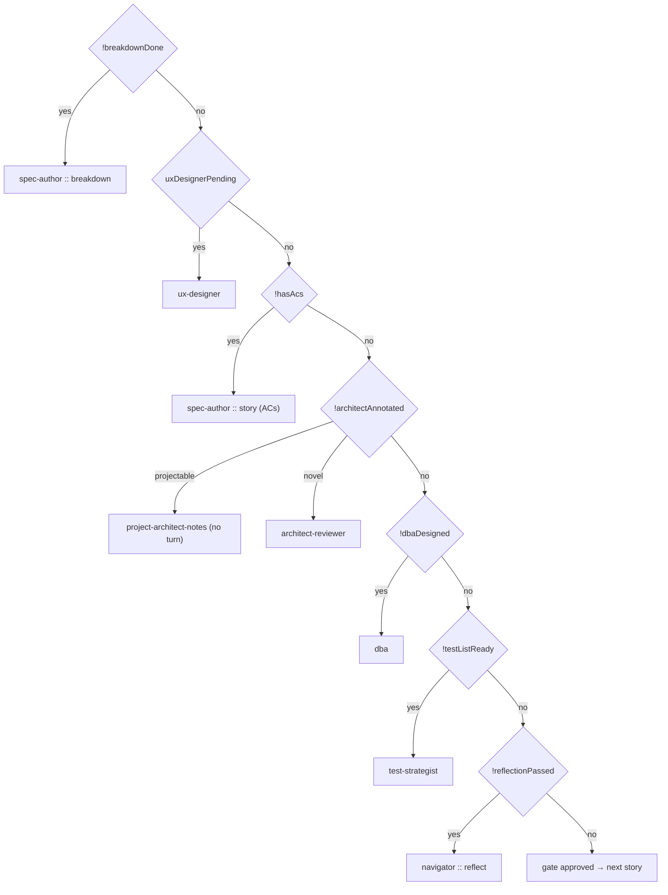
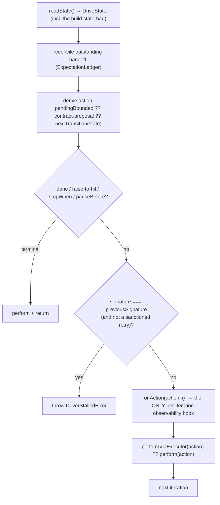
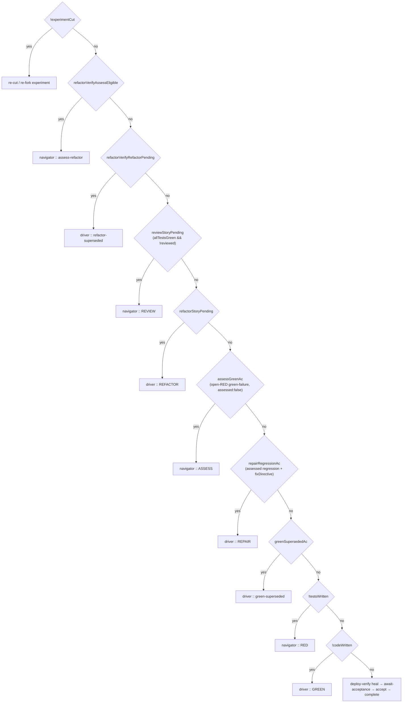

# Master Canonical Process

The authoritative record of what the orchestration **does**: its observable routes (as graphs)
and, per step, what it consumes, **emits / reports / produces**, and where it routes next.

> **Resuming after a context compact/clear?** This document IS the context. Read **§8 Working state
> & resume context** (at the end) FIRST — it carries what is fixed, what is in flight, what is
> blocked, and the exact resume points, so you do not need to re-derive from code or reload prior
> conversation. Then use the sections below (routes, dispatch, recorder, per-step payloads) as the
> reference they cite by `file:line`.

**Derived from source, not from prose.** Every node, edge, and payload below is read out of the
code and the shipped manifests (`consort/orchestrator/steps/manifests/*.json`), the step contract
(`consort/orchestrator/steps/step-contract.ts`), and the routing/state code
(`consort/orchestrator/drive/orchestrator-drive.ts`, `consort/orchestrator/state/*`,
`consort/pipeline/cycle-record.ts`). If the orchestration is observed to emit / report / do
something this document's canonical model does not name, **the canonical model is updated** (see
the change log at the bottom) — the code is the ground truth, this doc follows it.

Two dimensions:
- **Graphs** — the observable ROUTES. The orchestrator is a deterministic state machine
  (`nextTransition(state) → action` is a pure function of recorded state), so its routes ARE a
  graph: nodes = steps/phases, edges = the routing predicates that fire. Rendered as mermaid.
- **Tables** — the per-node PAYLOAD (inputs → emits → produces, channels, validators, agent
  config), which is tabular, not topological. See the per-step template + chain sections.

Status: IN PROGRESS. Documented so far: the **top-level phase machine**, the **planning** and
**feature (design + build)** lane graphs, the canonical model (StepContract), the **spec-author**
chain, and the **review-vs-assess** routing mechanism. Remaining per-step payloads are TODO.

---

## 0. The beginning — the top-level phase machine

`nextTransition(state)` (`orchestrator-drive.ts:195`) is THE entry point. Given the recorded
`DriveState`, it returns the single next `WorkflowAction` — no I/O, no model. Escalation
(`escalationPreempt`) pre-empts everything first. Then it dispatches by `state.phase`:



Any phase can be pre-empted to `raise-to-hil` by `escalationPreempt(state)` — escalation never
false-greens past a problem or spins on await-acceptance.

### 0.1 Planning lane (`state.phase === "planning"`)



`--no-sizing` (`skipSizing`) drops both estimate steps. The plan gate is the HITL checkpoint that
locks the backlog before any feature is driven.

### 0.2 Feature lane (`state.phase === "feature"`) — design + build, per story

The feature phase streams design and build. It always advances the FIRST not-yet-done story
(structural: exactly one story in design at a time), so the spec-author is invoked per story.



### 0.3 Design lane (`nextDesignAction`, `orchestrator-drive.ts:53`)

Per the first not-yet-gate-approved story, in breakdown order:



---

## 0.4 The drive loop + observability (`runDriver`, `orchestrator-run.ts:189`)

`nextTransition` is the pure brain; `runDriver` is the loop that turns it. Per iteration
(`orchestrator-run.ts:227-340`):



**The observability seam — and the gap that matters for a route-debugging re-record:**

`onAction(action, i)` (`orchestrator-run.ts:57`, `319`) is the sole per-iteration hook. It receives
**the action that was chosen and the iteration index — NOT the `DriveState` / build state-bag that
chose it.** The loop reads `state` at line 234, derives `action` from it, then logs only `action`.

Consequence: when a green routes to `review` instead of `assess`, the recorded log shows
*"review was chosen at iteration N"* but never *"`{reviewStoryPending:true, assessGreenAc:false,
allTestsGreen:true}` is why review won."* The **decision inputs are not captured** — which is
exactly why route bugs cannot be diagnosed from the recorded corpus and had to be reverse-engineered
from stale artifacts. `onAction` already receives the action; the state bag it was derived from is
available in the same scope (`state`) but is not passed. This is the seam where routing
instrumentation belongs (see §6, instrumentation plan — TODO after the logging inventory).

The other effects the loop drives:
- `readState()` — builds `DriveState` from disk (the probes in §4 read the same disk state).
- `perform(action)` / `performViaExecutor(action, state, routerDeps)` — runs the turn. The executor
  path already ran `validateAndBound` (phase 7) and hands back a `BoundedRoute` consumed next
  iteration (`pendingBounded`); the non-executor path performs then asks the contract for a proposal.
- `onHandback(handoff, detail)` — fired when a responder's contract was unmet (one informed retry).

---

## 0.5 Dispatch paths — executor (canonical) vs legacy (`executor-dispatch.ts:89`)

An agent turn (`invoke-role`) is dispatched one of two ways, decided by `executorDispatched(action)`.
This split is documented for transparency because "which path a turn takes" governs what gets
recorded + which behaviors apply.

**Executor path (canonical, the intended sole path):** `performViaExecutor` → the StepExecutor
Template Method → `ClaudeStepAgent` via `liveDispatchSeam`. Records the full replay-set (§6.5),
captures the transcript (via the record wrapper), runs the manifest's pre/post-turn hooks + output
validation + `validateAndBound`. `executorDispatched` returns **true** for:
- spec-author `breakdown` / `propose`; architect-reviewer `estimate`
- per-story design: spec-author (ACs) / architect-reviewer / test-strategist / dba (all story-scoped); ux-designer (feature-scoped)
- navigator `reflect` / `assess` / `assess-deploy` / `assess-refactor` / `review` (story-scoped)
- driver + navigator RED/GREEN and the driver self-heal buildModes (story-scoped)

**Legacy path (`commandsForAction`, being deprecated):** for actions `executorDispatched` returns
**false**, `performViaExecutor` returns `undefined` and the turn falls to `commandsForAction`
(`orchestrator-effects.ts`). Today that is:
- **`product-owner` `author-requests`** and **`architect-reviewer` `estimate-committed`** (`executor-dispatch.ts:98`) — the two agent modes NOT yet migrated. They run every sprint.
- Any un-allowlisted role/mode, or an env override `LAKEBASE_SFTDD_USE_MANIFEST_STEPS=0/false/off/no` which forces ALL actions to legacy.
- **Non-agent actions** (`planning-complete`, `feature-complete`, `deploy-complete`, gates, dispatch,
  cut-experiment, `set-phase`) are `kind !== "invoke-role"` → they are NOT agent turns and correctly
  flow through the deterministic `commandsForAction` path. `set-phase` (the phase-transition writer)
  lives here BY DESIGN — it is a drive-loop concern, never an agent turn, so it is NOT an executor
  gap.

**Divergence found + status (the reason this section exists):** the legacy contained-spawn path
captured the agent TRANSCRIPT; the executor path dropped it (a double-consume race on
`takeLastAgentTranscript`). FIXED — the intermediate consumer now PEEKS (`peekLastAgentTranscript`),
leaving the record wrapper as the sole taker. A per-turn hard-fail audit (`assertTurnComplete`, §6.5)
now aborts a live capture the moment any agent turn is missing its expected recorded files, so a
silent drop like this cannot recur.

**Deprecation — DONE (runtime hard-stop live).** `author-requests` + `estimate-committed` are
NOT agent turns (author-requests is human-input via the proxy; estimate-committed's work is a
deterministic sync-backlog), so instead of migrating them to the agent executor they are named in a
sanctioned **`deterministicAgentless`** allowlist (`executor-dispatch.ts`). The runtime guard
**`assertNotStrandedAgentTurn`** now runs at the TOP of `perform` (orchestrator-effects.ts): any
`invoke-role` action reaching the legacy path that is neither `executorDispatched` NOR
`deterministicAgentless` **throws loud** (a real agent turn escaped the executor , silent-corruption
class). Non-invoke-role drive actions (gates/dispatch/phase transitions/set-phase) are exempt.
Proven by `tests/bdd/legacy-path-guard.test.ts`. So a live run can no longer silently run an agent
turn on legacy. (Full retirement of the `commandsForAction` agent arm itself is the separate
standing #684; the guard makes any residual agent arm fail loud in the meantime.)

---

## 1. The canonical model — `StepContract`

`consort/orchestrator/steps/step-contract.ts` defines the ONE interface every step implements.
A step is dumb + contained: it declares logical descriptors; the **orchestrator** owns `.consort`,
resolves them to real paths, provides contents, validates outputs, and decides the route.

A step has **six faces**:

| Face | Signature | What it declares |
|---|---|---|
| `inputs` | `(action) => StepInputSpec[]` | Logical inputs that must exist before it runs (id + description; orchestrator resolves the path + hands back contents under `id`). |
| `preconditions` | `(action) => StepPrecondition[]` | Prepared context blocks (context-pack, green-failure-advisory) the orchestrator PROJECTS from `.consort` and appends/prepends to the prompt. Never authored, cannot drift. |
| `outputs` | `(action) => StepOutputSpec[]` | Logical artifacts it produces: id, description, channel-relative `filename`, `channel`, `optional?`, and an in-code `validate` (hard reject on fail, no agent round-trip). |
| `postTurn` | `(action) => PostTurnHook[]` | Deterministic pipeline hooks the orchestrator runs AROUND the turn (not the agent): `{bin, args, when: before\|after}`. |
| `agentOptions` | `(action) => AgentOptions` | Per-step agent-spawn levers: `{model?, effort?, session, resumeKeyFrom?}`. The optimize sweep patches these per candidate. |
| `route` | `(completed, ctx) => RouteProposal` | The routing intent it EMITS on completion: `{outcome, proposedNext, reason?}`. |

**`StepOutcome`** (what a step REPORTS): `produced` \| `blocked` \| `revise` \| `escalate`.

**Output channels** (where a produced file lands):
- `product` — the app deliverable (`app/`, `tests/`, migrations). ALWAYS uncontained (the real
  code tree); accumulates across build turns and ships.
- `artifact` — `.consort` design docs (feature-spec, architecture, acs, proposals). MAY be
  contained under `artifactDir`.
- `meta` — orchestrator bookkeeping (agent-log, reflect verdict, assess marker). Contained under
  `metaDir`.
- (absent) — the primary workspace root; byte-identical to a pre-channel single-root turn.

**The orchestrator is the authority over routing.** A step only PROPOSES `proposedNext`;
`validateAndBound` (step-contract.ts) validates it against the pure allowed transition and bounds
re-routes/retries/escalations:
- `produced` → honored iff it equals the pure allowed transition; else FALL BACK to allowed.
- `revise` → honored iff the revise budget has room; else convert to `raise-to-hil`.
- `blocked` → sanctioned retry of the same step until the retry ledger is exhausted (throws).
- `escalate` → straight to `raise-to-hil`.

**Exactness guard.** `assertExactStepContract(impl, label)` outright FAILS any implementation that
declares a member the canonical model does not name (TypeScript `implements` is a structural lower
bound and cannot reject an extra method). The allowlist `STEP_CONTRACT_MEMBERS` is pinned to the
interface at compile time via `satisfies Record<keyof StepContract, true>`, so it can never drift.
A StepContract impl therefore keeps private helpers as MODULE-LEVEL functions, not methods.

---

## 2. The per-step template

Every step below is documented in this standard shape:

```
### <step-id>
- Role / agent:      <role> via <agent kind>
- Binds to (match):  <the WorkflowAction shape that dispatches this step>
- Reached when:      <the routing predicate upstream that emits this action> (file:line)
- INPUTS:            <id> ← <source>  — <what it is>
- PRECONDITIONS:     <id> (<kind>, <position>) | none
- EMITS / PRODUCES:  <id> → <channel>/<filename>  [validator]  <required|optional>
- REPORTS:           <StepOutcome>
- ROUTES:            <manifest routing.produced.next → resolved next>
- POST-TURN:         <bin args when | none>
- AGENT CONFIG:      model / effort / session / resumeKeyFrom
```

---

## 3. The spec-author chain

The Spec Author has **three** orchestration steps, distinguished by the `match` on the action.

### spec-author-breakdown
- **Role / agent:** spec-author via `claude`
- **Binds to:** `{invoke-role, role:spec-author, mode:"breakdown"}`
- **Reached when:** `!state.breakdownDone` — the first design-lane action (`orchestrator-drive.ts:54`)
- **INPUTS:**
  - `product-overview` ← `feature:product-overview.md`
  - `nfrs` ← `feature:nfrs.md`
  - `feature-request` ← `feature:feature-request.md`
- **PRECONDITIONS:** none
- **EMITS / PRODUCES:**
  - `feature-spec` → **artifact**/`feature-spec.json` [featureSpecNonEmptyStories] — required (the feature breakdown index + a story stub per story)
  - `agent-log` → **meta**/`agent-log.jsonl` [agentLogHasRoleEvent] — required
- **REPORTS:** produced
- **ROUTES:** `state-derived` → re-derive next design action (→ ux-designer if UI track, else first story's ACs)
- **POST-TURN:** `PIPELINE_BIN reset-breakdown --tdd` (before); `PIPELINE_BIN sync-breakdown --tdd` (after)
- **AGENT CONFIG:** model=haiku, effort=low, session=**fresh**, resumeKeyFrom=role

### spec-author-propose (sprint-planning lane)
- **Role / agent:** spec-author via `claude`
- **Binds to:** `{invoke-role, role:spec-author, mode:"propose"}`
- **Reached when:** planning lane, `!planning.proposed` (`orchestrator-drive.ts:203`)
- **INPUTS:**
  - `product-overview` ← `feature:product-overview.md`
  - `nfrs` ← `feature:nfrs.md`
- **PRECONDITIONS:** none
- **EMITS / PRODUCES:**
  - `feature-proposals` → **artifact**/`planning/feature-proposals.md` [nonEmptyFile] — required.
    **Sprint-scoped → NO reconcile** (writes no feature artifact).
- **REPORTS:** produced
- **ROUTES:** `state-derived` (→ architect-estimator for sizing, or author-requests if `--no-sizing`)
- **POST-TURN:** none
- **AGENT CONFIG:** model=opus, effort=low, session=resume, resumeKeyFrom=role

### spec-author-story (per-story ACs)
- **Role / agent:** spec-author via `claude`
- **Binds to:** `{invoke-role, role:spec-author, mode:null, buildMode:null}` (bare per-story)
- **Reached when:** a story in breakdown order has `!design.hasAcs` (`orchestrator-drive.ts:81`)
- **INPUTS:**
  - `story-stub` ← `story:story.json`
  - `product-overview` ← `feature:product-overview.md`
- **PRECONDITIONS:** none
- **EMITS / PRODUCES:**
  - `acs` → **artifact**/`acs` (DIRECTORY, one `acs/<AC>.json` per AC) [acsDirConformant] — required
  - `agent-log` → **meta**/`agent-log.jsonl` [agentLogHasRoleEvent] — required
- **REPORTS:** produced
- **ROUTES:** `state-derived` (→ the architect step for the same story: `project-architect-notes` or `architect-reviewer`)
- **POST-TURN:** none
- **AGENT CONFIG:** model=opus, effort=low, session=resume, resumeKeyFrom=role

---

## 4. Build lane — `nextBuildAction` (`orchestrator-drive.ts:138`)

The build lane routes one story through RED → GREEN → REVIEW → REFACTOR, with self-heal detours.
The checks fire in a FIXED PRECEDENCE (first match wins); the order is load-bearing (self-heal +
review/refactor sit ABOVE the plain RED/GREEN so a just-greened AC is reviewed before the lane
advances). Edges are the state-bag predicates, top to bottom:



(`loop === "story"` uses `reviewStoryPending`/`refactorStoryPending`; `loop === "ac"` uses the
per-AC `reviewAc`/`refactorAc` at the same precedence slot.)

### 4.1 Routing mechanism: review vs assess after a driver GREEN

This is the decision the driver-optimize sweep tripped over, documented from source so it is not
re-derived by guesswork.

**In the graph above, `reviewStoryPending` is checked BEFORE `assessGreenAc`.** When both could be
true, **review wins**.

**`reviewStoryPending`** = `reviewPending()` (`cycle-record.ts:965`):
```
allTestsGreen && !reviewed
```

**`assessGreenAc`** = `assessGreenFailureAc()` (`orchestrator-probe.ts:343`):
```
the open-RED cycle's AC, when its GREEN verify FAILED and left a green-failure marker with assessed:false
```

**`storyAllTestsGreen`** (`cycle-record.ts:944`): `allGreen` over the story's test progress.

### The rule (canonical)

- **Assess is FAILURE-driven.** It fires ONLY when a green verify FAILS and writes a
  `green-failure.json` marker on an open-RED cycle. It is not driven by any code diff or
  contract change.
- **Review is ALL-GREEN-driven.** A green that passes the full suite makes the story all-green
  with no pending review → review. This is correct: a clean green SHOULD be reviewed.

### Consequence for the driver-green optimize seed (the bug)

The driver-green sweep seed drives a green that **passes its own suite** (`6 passed.` in the run
log). All tests green, no failure marker → `reviewStoryPending` → **review**. The review step's
`code` input (`story:code` → `<storyDir>/app`) is unmet (the driver writes `app/` at the project
ROOT), so it fails loud with `missing input "code"` → DISQUALIFIED.

**Therefore the assess route can only be reached by a green that genuinely FAILS the full suite**
(e.g. a correct change that breaks a prior test the story supersedes). The fix is NOT "rewind the
seed to a pre-contract code state" (no such faithful state exists in the recorded corpus — RED and
green trees are byte-identical there); it is to give the seed a **failing precondition** (a prior
test a correct green breaks) so the full-suite verify fails → `green-failure.json` → assess.
Capturing that transition faithfully is the motivation for a fresh, fully-logged re-record.

---

## 5. Logging inventory — the turn recorder (`turn-recorder.ts`)

`recordTurn` (`logging/turn-recorder.ts:253`) fires AFTER each turn's effect lands (wired via
`withTurnRecording`, gated on `LAKEBASE_CONSORT_RECORD_DIR`). Per turn it writes under
`turns/<NNNN>-<label>/`:

| Artifact | Content | Source |
|---|---|---|
| `turn.json` | `{ordinal, step, label, kind, role, mode, story, ac, action, produced[], deleted[], transcript?}` | the performed `action` + the file delta |
| `files/<rel>` | the `.consort` + code **delta** — every watched file whose sha changed this turn | `scan()` vs `.recorder-state.json` |
| `transcript.md` | prompt + final reasoning + ordered tool list (invoke-role turns only) | `RecordedTranscript` |
| `recorded-artifacts/<rel>` | cumulative `.consort` mirror (replay reads this) | mirrored from the delta |
| `turns/index.json` | ordered list of every turn | appended each turn |
| `.recorder-state.json` | relpath→sha map for the next turn's delta | rewritten each turn |

**What IS captured:** the action chosen, the full file delta (so a written `green-failure.json`
lands in `produced[]` + `files/` — the marker lifecycle is observable through the delta), and the
agent transcript.

**What is NOT captured (the instrumentation gap):** the **routing decision inputs** — the
`DriveState` build state-bag (`reviewStoryPending`, `assessGreenAc`, `allTestsGreen`, …) that
`nextTransition` read to CHOOSE the action. It is derived fresh each iteration (`orchestrator-run.ts:234`)
and discarded; `onAction` receives only the action (§0.4). So the recorder shows *what* was chosen
and *what files resulted*, never *why that branch won*.

**Why the recorded stockflow corpus has no assess markers:** assess requires a green that FAILS
(writes `green-failure.json`). The recorded greens PASSED → route to review → no marker written →
nothing to record. This is not a recorder gap; the recorded runs simply never produced a failing
green. A re-record that must capture the assess path needs a green that genuinely fails (§6).

---

## 6. Instrumentation plan for a diagnostic re-record

Goal: a re-record whose log answers *"why did each turn route where it did"* and captures the
assess path — the two things the current corpus cannot show.

**6.1 Routing-decision instrumentation (the load-bearing add).**
The seam is `onAction` (§0.4): it already receives `action`; the `state` it was derived from is in
the same scope (`orchestrator-run.ts:234-267`). Add a per-iteration routing record capturing, at
minimum, the build state-bag booleans + the derived action + iteration:
`{iteration, action, stateBag: {reviewStoryPending, refactorStoryPending, assessGreenAc,
repairRegressionAc, greenSupersededAc, testsWritten, codeWritten, allTestsGreen, ...}, source:
"nextTransition"|"bounded"|"contract"}`. Written to a `routing-decisions.jsonl` under the record
dir (a new meta stream, sibling to `turns/`). This is additive — it does not change routing, only
observes it. HERMETIC PROOF before any live run: a unit test that drives a known state and asserts
the routing record contains the bag that produced the action.

**6.2 Ensure the assess path is exercised.**
Per §4.1: assess fires only on a FAILING green. A faithful re-record that captures assess needs the
feature/story to contain a prior test a correct green legitimately breaks (the supersession case),
so the full-suite verify fails → `green-failure.json` → assess. This is a SEED/scenario property,
not a code change — the stockflow F6/S3 split-tracking story is the natural carrier (a correct
`inventory_code`-split green breaks the old combined-column tests). Confirm the recorded scenario
actually drives that failing green; if it does not, the re-record captures only the review path
again.

**6.3 New output directory + post-run audit.**
Record to a NEW `LAKEBASE_CONSORT_RECORD_DIR` (never overwrite an existing corpus). After the run,
audit: (a) `routing-decisions.jsonl` has one record per iteration with a non-empty state bag;
(b) at least one assess turn exists with its `green-failure.json` in `files/`; (c) `turns/index.json`
count matches the routing-decision count; (d) every invoke-role turn has a `transcript.md`.

---

## 6.4 The capture launcher — how a live re-record is driven (from the shell code)

The live re-record ("capture": design AND build run LIVE, every turn recorded) is driven by
`examples/replay/run-capture.sh` → `examples/replay/_replay-smoke.sh` (`replay_smoke`). Documented
from the shell source because the invocation contract is non-obvious and getting it wrong wastes a
live run.

**Invocation contract (`replay_smoke` arg parser, `_replay-smoke.sh:58`):**
- Accepted flags: `--tiers` (**required**, e.g. `2` = prod+staging), `--kit-ref`, `--project-name`,
  `--project-dir`, `--feature <F>`, `--sprint <name>`, `--plan-only`, `--corpus <PATH>`.
  There is **no `--scenario` flag** (that belongs to the sibling `replay-scenario.sh`).
- `--corpus` is a **path**, used as `<CORPUS>/features/<FEATURE>/…`; it must point at a corpus's
  `recorded-artifacts` dir and `--feature` must name a feature present there (which must carry a
  `feature-request.md`).

**Environment (hard preconditions, `_replay-smoke.sh:125`):** `DATABRICKS_HOST` and `GITHUB_OWNER`
must be **exported** — the engine does NOT source the test config itself (unlike
`replay-stockflow-rerecord.sh`). A launcher must source `.env.local.test.config`, resolve
`DATABRICKS_HOST` from the profile, and export `GITHUB_OWNER` (from `LAKEBASE_TEST_GITHUB_OWNER`)
before calling. This is why the checked-in launcher `examples/replay/captures/launch-stockflow-instrumented.sh`
exists: it does that env-prep, sets the recording + resume env, and invokes `run-capture.sh` with
the correct args.

**Recording + unattended resume:**
- `LAKEBASE_CONSORT_RECORD_DIR=<persistent dir NOT under the project>` turns recording on;
  `_replay-smoke.sh` auto-derives `LAKEBASE_CONSORT_RECORD_BUILD_DIR=<RECORD_DIR>/recorded-build`.
  With the §6.1 instrumentation, `routing-decisions.jsonl` is written at the same `recordDir` by
  the `withTurnRecording` seam.
- `run-capture.sh` sets `PAUSE_BEFORE=navigator`; `LAKEBASE_SFTDD_AUTO_CONTINUE=1` auto-confirms
  that pause (`_replay-smoke.sh:241`) so the run does design→build in one process, unattended.

**The scaffold-vs-reuse trap (`_replay-smoke.sh:127`):** `FRESH=1` unless `$PROJECT_DIR/.git`
exists, in which case `FRESH=0` → "reusing existing project, skip scaffold". A multi-feature
scenario relies on this (only the first feature scaffolds). But a **half-initialized project dir**
left by a crashed prior launch (a `.git` but no scaffold, so no `scripts/lk` shim) makes the engine
wrongly "reuse" it → the `lk` resolve fails with "could not resolve the runtime artifact dir". A
capture must therefore start from a project name/dir with **no pre-existing `.git`** (fresh stamp,
or clean the dir first). This is an $0 pre-cloud failure, but it blocks the run.

**The intake-dir trap (`_replay-smoke.sh:45`) — costs cloud if missed:** `--corpus` sets ONLY
`CORPUS_DIR` (the recorded design/build artifacts). The INTAKE dir (product-overview / nfrs /
design-brief the project is seeded with) is a SEPARATE resolution: `INTAKE_DIR=${REPLAY_INTAKE_DIR:-
${REPLAY_DIR}/corpora/bug-tracker}`. So a launcher that sets `--corpus` but not `REPLAY_INTAKE_DIR`
stages **bug-tracker's** intake into a stockflow project; the spec-author breakdown then fails loud
at turn 0 with `missing input "nfrs"` (bug-tracker's intake does not reconcile against the stockflow
feature). `replay-scenario.sh:70` is the pattern: it exports `REPLAY_INTAKE_DIR="${SCEN}/intake"`. A
capture launcher MUST set `REPLAY_INTAKE_DIR` to the scenario's own `intake/` dir. Unlike the two
traps above, this one fails AFTER provisioning (scaffold + runner + tier already cut), so it DOES
cost cloud — the launcher `launch-stockflow-instrumented.sh` now sets it.

**The feature-branch base defect (SCM claim) — the live blocker, verified from git:** on a fresh
capture the harness commits intake (`product-overview` + `nfrs` + `design-brief`) then the
feature-request to LOCAL `main` (commits `intake:…` then `plan: feature-request…`). But
`lk lakebase-scm-claim-feature-branch` cuts the feature branch from the **scaffold commit** (where
`origin/main` / `origin/staging` / `staging` still point — the pushed refs), NOT from local `main`
where intake was just committed. Observed git graph:
```
* a6c6910 (main) plan: feature-request for F1-stock-visibility   <- intake + request are HERE
* 333e5af        intake: product-overview + nfrs + design-brief  <- nfrs.md committed HERE, on main
* 715153f (HEAD -> feature-f1-..., origin/main, origin/staging, staging) Initial project scaffold
```
So the feature branch (cut from `715153f`) lacks the intake commits → `.consort/nfrs.md` is absent
on the branch the spec-author breakdown reads → `missing input "nfrs"` at turn 0 (AFTER cloud
provisioning).

**FIX LOCATION — the HARNESS, and it is a TIER bug (corrected + proven).** Two facts from
scm-utils, verified in source: (1) the claim's parent branch is `resolveParentBranch(tier_topology)`
— **tier-2 ⇒ `"staging"`**, tier-3 ⇒ `"dev"`, tier-1 ⇒ the default branch. (2) the git fork point
is `resolveFeatureStartPoint(parentBranch)`, which **prefers `origin/<parentBranch>`** (the paired
Lakebase branch was cut from that promoted state; git must match). stockflow-rerecord is
**`"tiers": 2`** (`scenario.json`), so its feature forks from **`origin/staging`**. But
`_replay-smoke.sh` checked out **`main`** for intake (line 161) and committed there — intake never
reached staging, so the feature (forked from staging@scaffold) lacked `nfrs.md` → breakdown fails
turn 0. This was misdiagnosed twice (as an intake-dir bug, then a push-to-main bug — both real but
insufficient); the true cause is the **wrong tier**. FIX (applied, PROVEN git-only end-to-end in a
throwaway origin-backed repo): (a) check out `staging` (the parent tier) before staging intake, not
`main`; (b) push the parent tier to origin before the claim so `origin/staging` carries intake. Do
NOT change scm-utils' tier/pushed-tip logic — it is correct; the harness was committing to the
wrong branch. Proof: intake-on-staging + push ⇒ the feature forked from `origin/staging` contains
`nfrs.md` + `feature-request.md`.

## 6.5 The per-agent-turn REPLAY SET (for optimization experiments)

Each agent turn records a self-contained **replay set** under `turns/<NNNN>-<label>/replay-set/`, so
an optimization experiment can replay THAT manifest step in isolation (sweep levers, re-run, judge)
without replaying the rest of the corpus. Written by `recordReplaySet` (`turn-recorder.ts`) from the
record wrapper's `recordingInvoke` **before** the agent mutates the tree:

| Part | Content | Source |
|---|---|---|
| `pre-project/` | the FULL project code tree BEFORE the turn (codeTreeFilter: app/tests/migrations; NEVER `.consort`/junk) | `walk(projectDir, codeTreeFilter)` |
| `inputs/<id>` | resolved input CONTENTS handed to the step, keyed by logical id | `invocation.inputs` |
| `prompt.txt` | the fully assembled prompt (preconditions already inlined) | `invocation.instructions.prompt` |
| `guidelines.json` | instruction guidelines | `invocation.instructions.guidelines` |
| `levers.json` | resolved levers (agentOptions + agent.config: model/effort/session/toolScope) | manifest, via `resolveLevers` |

Rationale for the split: agent turns are the SOLE mutators of the project code tree (deploy + postTurn
hooks touch only `.consort` + pid), so a `pre-project/` snapshot at each agent turn is the complete
code pre-state — a step replays without reconstructing the tree from turns 0..N-1. `.consort` is NOT
snapshotted here (it is delta-tracked every turn by `recordTurn` + the cumulative recorded-artifacts
mirror). The turn's OUTPUT (post-state) is the `recordTurn` delta (code + `.consort`) already. Together
the bundle is pre-state (`pre-project/` + inputs/prompt/levers) + post-state (delta) = a full replay
set. Only agent turns get one (the record wrapper only wraps agent invokes); gates/deploy do not.

**Post-run audit:** run `auditCorpus(<RECORD_DIR>)` (`consort/logging/audit-corpus.ts`, §6.3): it
reports per-turn expression gaps + routing-log completeness. `requireAssess:true` additionally
asserts the failing-green→assess path was captured. This is the loop engine: audit → fix
expression → re-record until `clean`.

---

## 7. Per-step payloads — every chain (from its manifest)

Read from `consort/orchestrator/steps/manifests/*.json`. Format:
`INPUTS: id←source` · `PRE: id(kind,pos)` · `EMITS: id→channel/filename [validator]` · `CFG:
model/effort/session/resumeKeyFrom` · `POST: bin`. A step with no `EMITS` produces no static
artifact — it is verified by its `@build-cycle` record + the state-derived route (§0.4/§4), and its
marker (assess/review/reflect verdict) lands via the file delta the turn recorder captures. All
design/build chains route `produced → state-derived` (the orchestrator re-derives; §0).

### 7.1 Design lane

**architect-estimator** — `{role:architect-reviewer, mode:estimate}` (planning lane)
- INPUTS: `feature-proposals←feature:planning/feature-proposals.md`
- EMITS: `estimates→artifact/planning/estimates.json [nonEmptyFile]`
- CFG: opus / default / resume / role · POST: —

**architect-reviewer** — `{role:architect-reviewer, mode:null}` (per story)
- INPUTS: `acs←story:acs` · `nfrs←feature:nfrs.md`
- EMITS: `architecture→artifact/architecture.json [nonEmptyFile]` · `agent-log→meta/agent-log.jsonl [architectReviewerLoggedAuthoring]`
- CFG: opus / low / resume / role · POST: —

**dba** — `{role:dba}`
- INPUTS: `architecture←feature:features/{feature}/architecture.json`
- EMITS: `db-design→artifact/db-design.json [nonEmptyFile]` · `agent-log→meta/agent-log.jsonl [dbaLoggedAuthoring]`
- CFG: sonnet / low / resume / role · POST: —

**ux-designer** — `{role:ux-designer}`
- INPUTS: `design-guideline←feature:design/design-brief.md` · `product-overview←feature:product-overview.md`
- EMITS: `design-guide→artifact/design-guide.json [designGuideConformant]` · `agent-log→meta/agent-log.jsonl [uxDesignerLoggedAuthoring]`
- CFG: opus / low / **fresh** / role · POST: —

**test-strategist** — `{role:test-strategist}` (supervisor; fans out to per-analyst subagents)
- INPUTS: `acs←story:acs` · `architecture←feature:features/{feature}/architecture.json` · `db-design←feature:features/{feature}/db-design.json`
- PRE: `test-analyst-roster(test-analyst-roster, append)` — the injected analyst roster the supervisor fans out to
- EMITS: `test-list→artifact/test-list.json [nonEmptyFile]` · `agent-log→meta/agent-log.jsonl [testStrategistLoggedAuthoring]`
- CFG: sonnet / low / resume / role · POST: `TEST_LIST_BIN {tddDir} {feature} {story}`

### 7.2 Build lane — navigator

**navigator-red** — `{role:navigator, buildMode:null}` (authors the failing tests)
- INPUTS: `test-list←story:test-list-per-story.json` · `acs←story:acs`
- EMITS: `tests→product/tests [navigatorTestsAuthored]` (uncontained, ships) · `agent-log→meta/agent-log.jsonl [navigatorLoggedAuthoring]`
- CFG: opus / low / resume / **story** · POST: `@build-cycle`

**navigator-assess** — `{role:navigator, buildMode:assess}` (the failing-green discriminator, §4.1)
- INPUTS: `green-failure←story:green-failure.json` · `acs←story:acs`
- PRE: `advisory(green-failure-advisory, prepend)` — the failure advisory prepended to the ASSESS directive
- EMITS: — (writes a superseded-tests.json / regression-assessment.json marker via the delta, or NOTHING when it escalates a genuine regression)
- CFG: sonnet / default / resume / story · POST: `@build-cycle`

**navigator-review** — `{role:navigator, buildMode:review}` (all-green story review, §4.1)
- INPUTS: `code←story:code` · `acs←story:acs`
- EMITS: — (writes review-verdict.json via the delta; refactor:true/false)
- CFG: sonnet / low / resume / story · POST: `@build-cycle`

**navigator-reflect** — `{role:navigator, buildMode:reflect}` (pre-build design reflection)
- INPUTS: `design←story:design`
- EMITS: — (writes reflect-verdict.json via the delta)
- CFG: **haiku** / low / resume / story · POST: `@build-cycle`

**navigator-assess-deploy** — `{role:navigator, buildMode:assess-deploy}` (deploy-verify self-heal)
- INPUTS: `deploy-verify-assess←story:deploy-verify-assess.json`
- EMITS: `scope→meta/deploy-verify-scope.json [deployVerifyScopeConformant]` **(optional)** — absent when it escalates
- CFG: sonnet / default / resume / story · POST: `@build-cycle`

**navigator-assess-refactor** — `{role:navigator, buildMode:assess-refactor}` (refactor-verify self-heal)
- INPUTS: `refactor-verify-failure←story:refactor-verify-failure.json`
- EMITS: — · CFG: sonnet / default / resume / story · POST: `@build-cycle`

### 7.3 Build lane — driver

**driver-green** — `{role:driver, buildMode:null}` (makes the tests pass)
- INPUTS: `test-list←story:test-list-per-story.json`
- EMITS: `code→product/app [driverCodePresent]` (uncontained, ships) · `agent-log→meta/agent-log.jsonl [driverLoggedAuthoring]`
- CFG: sonnet / default / resume / story · POST: `@build-cycle`

**driver-repair** — `{role:driver, buildMode:repair}` (bounded fix of an assessed regression)
- INPUTS: `regression-assessment←story:regression-assessment.json`
- EMITS: — (re-greens the product code; correctness is the @build-cycle honest-GREEN, not a static artifact)
- CFG: sonnet / default / resume / story · POST: `@build-cycle`

**driver-refactor** — `{role:driver, buildMode:refactor}` (post-review cleanup)
- INPUTS: `code←story:code`
- PRE: `pack(context-pack, append)` — the design context-pack appended
- EMITS: — · CFG: **haiku** / default / resume / story · POST: `@build-cycle`

**driver-green-superseded** — `{role:driver, buildMode:green-superseded}` (permissive re-green after a supersession assess)
- INPUTS: `test-list←story:test-list.json` · EMITS: — · CFG: sonnet / default / resume / story · POST: `@build-cycle`

**driver-refactor-superseded** — `{role:driver, buildMode:refactor-superseded}` (refactor-verify self-heal re-refactor)
- INPUTS: `superseded-tests←story:superseded-tests.json` · EMITS: — · CFG: haiku / default / resume / story · POST: `@build-cycle`

**driver-refactor-deploy** — `{role:driver, buildMode:refactor-deploy}` (deploy-verify self-heal scope refactor)
- INPUTS: `deploy-verify-scope←story:deploy-verify-scope.json` · EMITS: — · CFG: haiku / default / resume / story · POST: `@build-cycle`

### 7.4 Observations from examining the manifests

- **Model tiering is per-turn, not per-role.** The navigator is opus for RED (authoring is the
  expensive reasoning) but sonnet for assess/review and haiku for reflect. The driver is sonnet for
  GREEN/repair but haiku for the refactor turns. Effort is mostly `default`/`low`.
- **Session is `resume` everywhere except two `fresh` turns** — spec-author-breakdown and
  ux-designer (both author once from scratch, no prior turn to warm from).
- **Build turns resume on `story` scope; design turns on `role` scope** — the resumeKeyFrom axis
  matches the lane's unit of continuity.
- **Every build turn's POST is `@build-cycle`** (the cycle recorder); design turns have no POST
  except breakdown (`reset/sync-breakdown`) and test-strategist (`TEST_LIST_BIN`).
- **Self-heal navigator/driver turns emit NO static artifact** — their marker lands via the file
  delta the turn recorder captures, and their route is state-derived off that marker. This is why
  §5's assess-path audit keys on the `green-failure.json` in the delta, not on a declared output.

---

## 8. Working state & resume context (read FIRST after a compact/clear)

The live state of the capture/instrumentation effort, so this doc alone re-establishes context.

### 8.1 The goal
Produce a **fresh live stockflow-rerecord capture** where every agent turn is fully recorded as a
**replay set** (§6.5) — the corpus that seeds per-manifest-step optimization experiments. The
capture is driven by `examples/replay/captures/launch-stockflow-instrumented.sh` (§6.4), records to
`examples/replay/captures/stockflow-instrumented-<stamp>/`.

### 8.2 What is DONE + PROVEN (in source + dist; full suite green ~3480)
- **Routing-decision instrumentation** — `onRoutingDecision` per iteration → `routing-decisions.jsonl`
  (the "why" the recorder lacked). `turn-recorder.ts` `recordRoutingDecision`/`projectRoutingStateBag`.
- **Per-agent-turn replay set** (§6.5) — `recordReplaySet` writes `replay-set/{pre-project/, inputs/,
  prompt.txt, guidelines.json, levers.json}`; verbatim `prompt.txt`; full project code pre-snapshot;
  `.consort` stays delta-tracked. Wired in `replay-recorder-wrapper.ts` via `turnDirFor`.
- **Transcript double-consume race — FIXED** — `claude-step-agent.ts` now `peekLastAgentTranscript`
  (not take), leaving the record wrapper the sole taker; else executor turns dropped `transcript.md`.
- **Per-turn hard-fail audit** — `assertTurnComplete` + `expectedTurnFiles` (`turn-recorder.ts`):
  a LIVE capture aborts the moment any agent turn is missing an expected file (scoped via
  `liveCapture = ctx.takeTranscript !== undefined`, so replay/migration/test records are exempt).
- **Corpus audit tool** — `consort/logging/audit-corpus.ts` `auditCorpus(recordDir)` (§6.3).
- **Capture harness fixes** (all in `_replay-smoke.sh` + the launcher): intake staged on the PARENT
  TIER (staging for tier-2), pushed to origin before the claim; `REPLAY_INTAKE_DIR` = scenario intake;
  feature-request authored via the author-requests turn (not bare cp) when `--sprint` is set.
- **Manifest input-path fixes**: `spec-author-breakdown` feature-request → `feature:features/{feature}/
  feature-request.md`; `navigator-reflect` `story:design` → `story:acs` (both had no
  writer/resolver at the declared path). Manifests are BUNDLED INTO DIST at build → **rebuild dist
  after any manifest edit** or the live run uses the stale path.
- **Dispatch split documented** (§0.5). Legacy-path audit (§0.5) done: 1 real divergence (transcript,
  fixed) + 1 false positive (set-phase — a deterministic drive-loop concern, NOT an executor gap).

### 8.3 Last live capture (stopped intentionally)
`stockflow-instrumented-20260808-103314` reached the BUILD lane (navigator-RED done, driver-green
dispatching) with 18 turns + 11 replay-sets recorded, before being stopped to fix the transcript
bug. It PROVED: breakdown passes, navigator-reflect passes (the `story:acs` fix), replay-sets are
complete (pre-project/inputs/prompt/levers all present). Its orphan Lakebase project was reclaimed
(zero orphans). The transcript fix + hard-fail audit are NOT yet in a dist that ran live.

### 8.4 OPEN — resume points, in order
1. **#734 + #732 — DONE.** author-requests + estimate-committed are named in the sanctioned
   `deterministicAgentless` allowlist (they are NOT agent turns); the runtime hard-stop
   `assertNotStrandedAgentTurn` fires at the top of `perform` for any invoke-role action that
   escapes the executor without being sanctioned. Proven (`legacy-path-guard.test.ts`). See §0.5.
2. **#727 (the re-record) — the main remaining action:** rebuild dist (transcript fix + hard-fail
   audit + manifest fixes + the new guard), then re-launch the capture via the launcher (§6.4).
   Pre-flight: zero orphans, auth `AUTH_OK`, dist fresh. GATED — ~$300 + live Lakebase; needs
   explicit go each launch. The hard-fail audit (§6.5) now protects the corpus (a dropped artifact
   aborts at that turn); the guard (§0.5) ensures no agent turn silently runs on legacy.
3. **#684 (standing, separate):** fully retire the `commandsForAction` agent arm. Not required for
   the capture — the guard already makes any residual agent arm fail loud.

### 8.5 Hard-won operational rules (do not relearn)
- **Rebuild dist before any live run** — manifests + TS are bundled; a stale dist runs old code.
- **Orphan reclaim after any stopped run:** `databricks postgres delete-project projects/<name>
  --profile <the test profile>`, one name per call; confirm zero `stockflow-instrumented` projects
  remain. The profile is NOT hardcoded anywhere , it lives in `.env.local.test.config`
  (`DATABRICKS_CONFIG_PROFILE`), read via `provisioning/test-env.ts` (`resolveTestEnv`); the `#595`
  guard forbids re-hardcoding the workspace host in source (incl. this doc).
- **The launcher computes its OWN stamp** (its `date` differs from an outer stamp) — track the run
  by the log path + `postgres list-projects`, not the outer stamp.
- **`--no-verify` is blocked** in this environment — never bypass git hooks; drop the flag.
- Owner + profile + host come from `.env.local.test.config` (never inline them). Scenario is tier-2;
  sprint `stockflow-rerecord-s1` ships F1, `-s2` ships F6 (the assess / expand-contract path).

---

## Canonical model change log

- **2026-08-08** — Added `postTurn` and `agentOptions` as first-class `StepContract` faces.
  Discovered while documenting the spec-author chain: every manifest declares `agentOptions`, and
  breakdown declares `postTurn` hooks (`reset-breakdown` / `sync-breakdown`) — real things a step
  does that the interface did not name. Added the types, the two interface methods, the
  `STEP_CONTRACT_MEMBERS` compile-pinned allowlist, and `assertExactStepContract`.
- **2026-08-08** — Transcript double-consume race fixed (peek-not-take); per-turn hard-fail record
  audit added (`assertTurnComplete`); per-agent-turn replay set added (`recordReplaySet`, §6.5);
  routing-decision stream added (`recordRoutingDecision`). Dispatch split + legacy deprecation plan
  documented (§0.5). Capture harness + two manifest input-path bugs fixed (§8.2).
